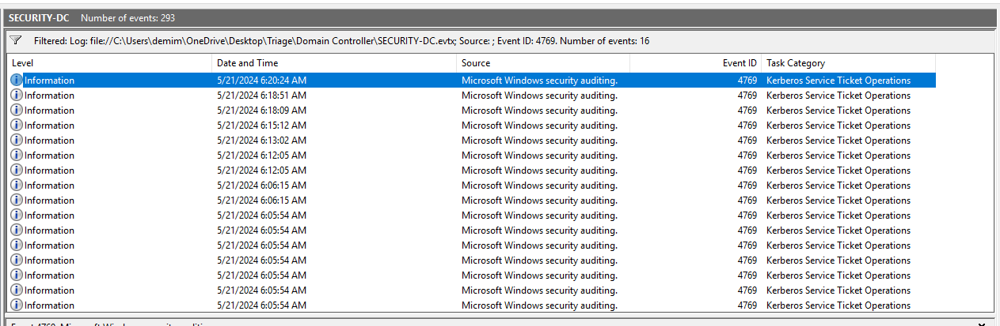
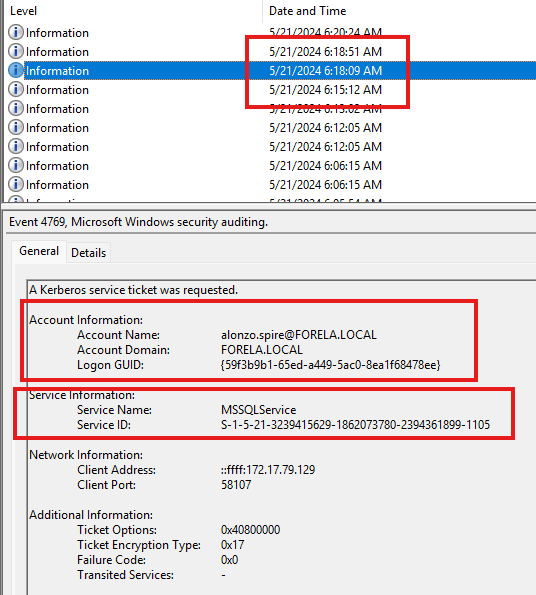
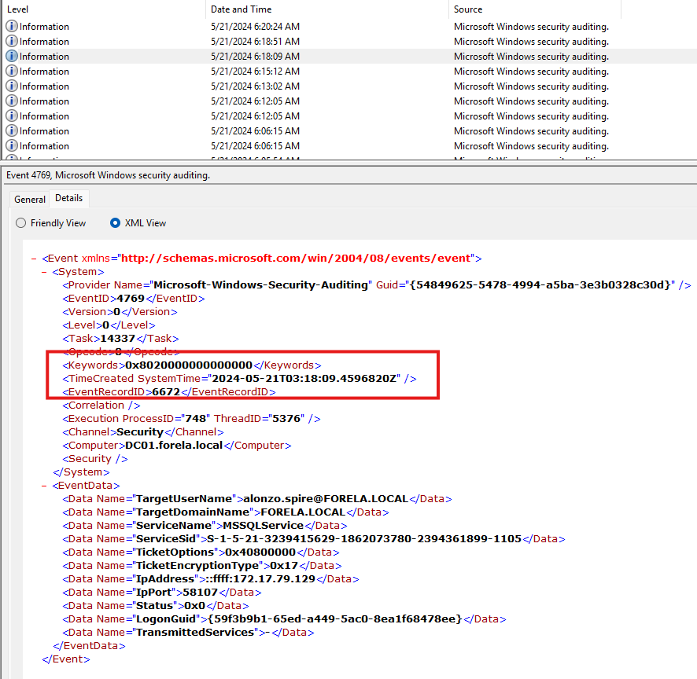
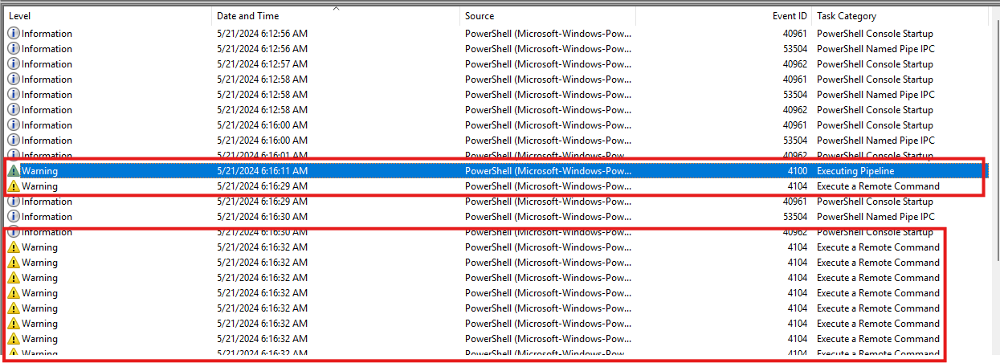
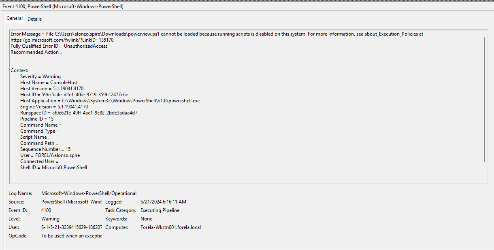
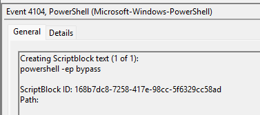
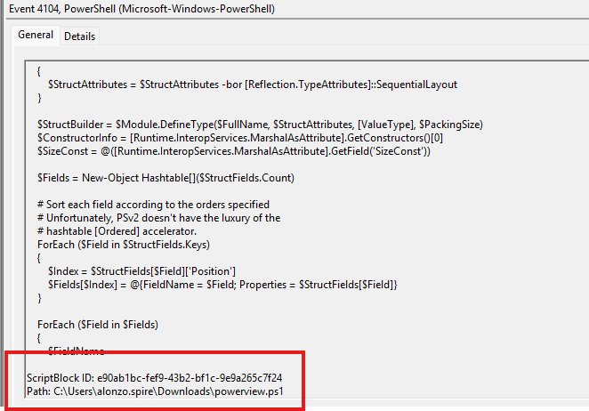
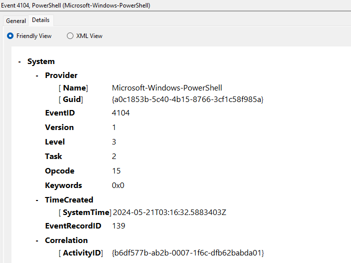
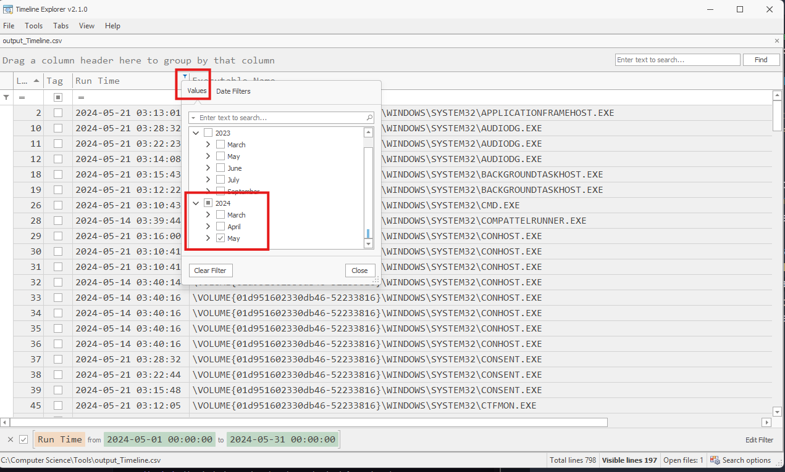
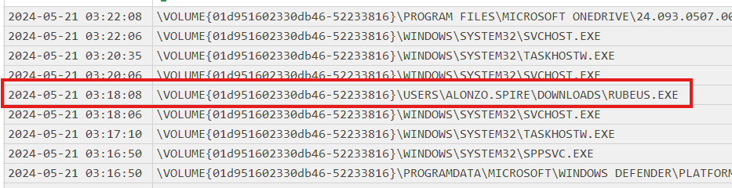

---

Since this is a Kerberoasting attack, we can detect it by looking for event IDs `4679` which mean that a TGS ticket has been requested from the KDC.
- We can filter for this event ID in the windows event viewer in the `SECURITY-DC` log.



However, the event ID `4769` by itself does not indicate the attack, we need to look for certain fields in these events that can be suspicious:
- Look for *ticket encryption type* that is weak and can be cracked, such as `0x17` for RC4 or `0x1` and `0x3` for DES.
- Look for weird *Account Name* that requests a ticket for a service account. The name should be something that is not a computer name or a domain controller for example.
- Look for *Service Name* that are not computer accounts, as these would have large and complex passwords.



With this in mind, we get this event from the account name `alonzo.spire@FORELA.LOCAL`, this is the account that was compromised by the attacker to be used to request TGS tickets. The service that was requested is the `MSSQLService`, and we see the encryption type `0x17` which is the vulnerable encryption type.
- We can also see the IP address of the client that requested this ticket in the *Client Address*, being `172.17.79.129`.

We need to get the UTC time, not the time displayed above. This can be done simply by opening the *details* tab and checking the time from there.



> Analyzing Domain Controller Security Logs, can you confirm the date & time when the Kerberoasting activity occurred? : `2024-05-21 03:18:09`.

> What is the Service Name that was targeted?: `MSSQLService`.

Now, we go to the other `.evtx` file with the PowerShell logs.
- First, we sort the events in the correct time order that they happened in by sorting by time. 



We see first the warning event with ID 4100:



We see that the user tried to execute a file called `powerview.ps1` but couldn't because running scripts is disabled.
- Following that event directly, is one with ID 4104, checking it we see a PowerShell code to enable script execution:



> This command is used to enable script execution.

After that, we see several events with ID 4101, and going through them we see scripts being successfully run.

We can conclude that the attacker tried to run `powerview`, which is a tool used for post exploitation in Active Directory environments, but failed.
- So they enabled script execution, successfully, then started to utilize `powerview` to achieve their goals.
- This tool is used to enumerate for objects to be targets for the Kerberoasting attack.

Opening any of the events with ID 4101 and scrolling down to the `path`, we see the `powerview.ps1` tool in use:



> Now that we have identified the workstation, a triage including PowerShell logs and Prefetch files are provided to you for some deeper insights so we can understand how this activity occurred on the endpoint. What is the name of the file used to Enumerate Active directory objects and possibly find Kerberoastable accounts in the network?: `powerview.ps1`.

Opening the first event with ID 4104 and opening the `Details` pane to check the UTC time:



> When was this script executed?: `2024-5-21 03:16:32`.

Continuing to the end of the `evtx` file, it is more scripts being run in PowerShell for the powerview tool, with nothing after.
- powerview is the tool used to enumerate for users to target, not the tool used to do the actual attack.
- This makes us pivot to the prefetch files we have.

Prefetch files are execution artifacts on Windows machines, that is they are evidence of program execution. Prefetch files record information about the execution of various applications and the associated timestamps.
- Analyzing prefetch files can be done with the [PECmd](https://github.com/EricZimmerman/PECmd) and Timeline Explorer Eric Zimmerman tools that can be downloaded from [here](https://ericzimmerman.github.io/#!index.md).

The first step to do is download the tools, once that is done, we can run the following command in PowerShell:
```powershell
.\PECmd\PECmd.exe -d "C:\Triage\Workstation\2024-05-21T033012_triage_asset\C\Windows" --csv . --csvf output.csv -q
```
- The `-d` specifies the directory to run the tool on, which is the entire folder of the prefetch files.
- The `--csv .` specifies where to save the output files from the command execution.
- The `--csvf output.csv` specifies the filename.
- The `-q` speeds up the tool execution.

After running this, we get two files as output. I will use the `_Timeline.csv` file as it look easier to read and has enough details relating to time and path.
- To use it, we open the Timeline Explorer tool and choose it from inside.

We see a lot of lines, and we need to find a way to pivot.
- Going back, we remember that the malicious TGS that was requested was done at the following date and time: `2024-05-21 03:18:09`
- The malicious tool is likely the tool that requested this TGS ticket. Therefore, we need to look for any tool activity around that date and time.

1. First, we filter the Run Time column for the month of May in 2024.



2. Look for events around the time of `03:18:09`.



We see the Rubeus tool being used, which is used to perform the Kerberoasting attacks by sending out TGS tickets to the identified account.
- It was run 1 second before the event log for the TGS ticket being sent, so it was this exact execution that triggered it.

We see the path is `\VOLUME{01d951602330db46-52233816}\USERS\ALONZO.SPIRE\DOWNLOADS\RUBEUS.EXE`, and we can replace the volume and the large number with `C:\`.

> What is the full path of the tool used to perform the actual Kerberoasting attack?: `C:\USERS\ALONZO.SPIRE\DOWNLOADS\RUBEUS.EXE`.

> When was the tool executed to dump credentials? : `2024-05-21 03:18:08`.

---
