### Initial Analysis

We get 2 files:
- `meerkat-alerts.json`
- `meerkat.pcap`

I choose to first investigate the `json` file as it contains only the alerts, which will make it easier to pivot in the large amount of alerts and logs present.
- Opening it, we see that it is not properly spaced out and lined, making it hard to read.

To easily view `json` files on the terminal and interact with them, the `jq` tool can be used.
- Printing the contents of the file using `cat` and then piping into `jq` and echoing all of that into a file called `pretty-alerts.json`
```bash
cat meerkat-alerts.json | jq > pretty-alerts.json
```

Now, we have a `json` file with the alerts in an easy format to read.
- Next, we have to analyze this alerts file.
- Going through it, we see that most of the alerts have the `alert.signature` field which gives information about the type of alert.
- We also see the `src_ip`, containing source IP address.
- There are other fields but I will not go through them for now.

To analyze all the `signature` types, we can use the `jq` tool to read all of its values, and then we can list all unique values and then sort them by count to see frequencies.
```bash
cat pretty-alerts.json | jq .[].alert.signature -r | sort | uniq -c | sort -nr
```
- The `.[].alert.signature` selects the values of the `signature` field.
- The `-r` returns them as strings with no quotes.
- The first `sort` sorts all the signatures.
- The `uniq -c` then prints only the unique values of the signatures along with their counts.
- The final `sort -nr` sorts the output of the `uniq` by their number in descending order.

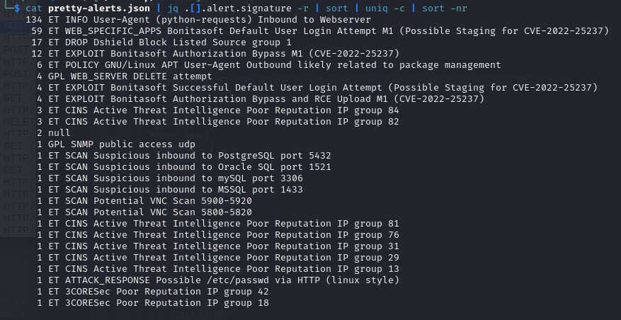

We see several important things:
- There are 134 requests made using `python-requests`, possibly a brute force attempt.
- There is something called `Bonitasoft` application, and with a CVE of `CVE-2022-25237`.
- We then see alerts related to successful login attempt, authorization bypass, RCE upload.
- We see at the very end `/etc/passwd`.

> Through this we see that the CVE `CVE-2022-25237` is the one being exploited, and it might have worked.

Next, we analyze the `src_ip` field using the same technique as above.
```bash
cat pretty-alerts.json | jq .[].src_ip -r | sort | uniq -c | sort -nr
```

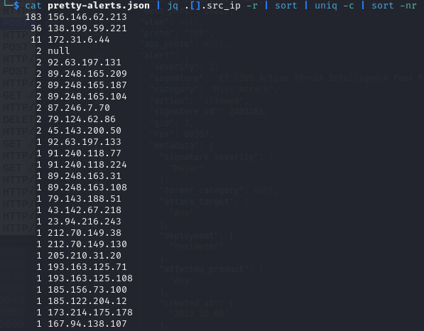

We see the IP `156.146.62.213` is responsible for a large portion of the alerts, followed by `138.199.59.221`.

> With this information, we now know the type of CVE being exploited, some details about how it happened, and the IPs that are most probably responsible. We can now use this information to jump into the questions and the large `.pcap` file.

We can also do some research on the CVE `CVE-2022-25237`.
- Heading [here](https://nvd.nist.gov/vuln/detail/CVE-2022-25237), we see the following:
```text
Bonita Web 2021.2 is affected by a authentication/authorization bypass vulnerability due to an overly broad exclude pattern used in the RestAPIAuthorizationFilter. By appending ;i18ntranslation or /../i18ntranslation/ to the end of a URL, users with no privileges can access privileged API endpoints. This can lead to remote code execution by abusing the privileged API actions.
```

### Task 1

> We believe our Business Management Platform server has been compromised. Please can you confirm the name of the application running? : `BonitaSoft`.

### Task 2

Now, we need to get into the `.pcap` file and investigate it using Wireshark.
- Given the IP we discovered above that had the largest amount of requests, we can filter for it in Wireshark.
```
ip.addr == 156.146.62.213
```

We see a large amount of packets going back and forth between our IP address and `172.31.6.44`.
- From the nature of these packets, it looks like this is a port scan, as each row contains a `SYN` packet sent to a new port on `172.31.6.44`, and if the port is closed, it returns a `RST, ACK` packet.
- It also looks like a port scan because each packet sent from our IP address is sent from a new port that is 1 increment of the port before it to not get blocked.

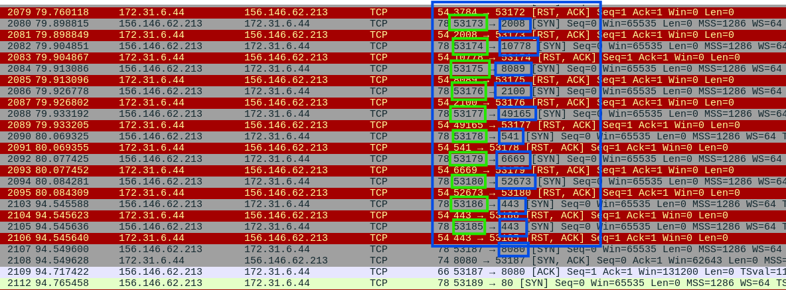

The green boxes showcases the source port from our IP, `156.146.62.213`, and the blue boxes showcase the destination port that is being scanned.
- At the very end, we see that port `8080` does not return a `RST,ACK` response, but instead, it connects normally.
- Afterwards, but not in the picture above, we see the attacker trying to access port `80`, but also `RST,ACK` response is returned.

Now, that the attacker, our IP, `156.146.62.213` has discovered an open port, `8080`, the attack can begin.
- This goes along with our hypothesis as port `8080` is used to host web applications, and we know that the exploit is done on a web application called `BonitaSoft`.

We see now that the requests turn into `HTTP` requests, and theyonly take place between our 2 IPs:
- The attacker `156.146.62.213`
- The victim server `172.31.6.44`

Scrolling through these requests, we see that they are all the same thing over and over again.
- A `POST` request is sent to the URL `/bonita/loginservice` with some data.
- The server responds with a `401` not found response.

Opening one of these `POST` requests, we see the following:

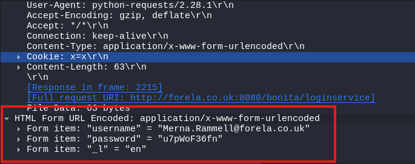
- An attempt to login with a username and password.

If we filter our Wireshark results better, we will get an improved picture of what's happening.
```
ip.addr == 156.146.62.213 && http
```

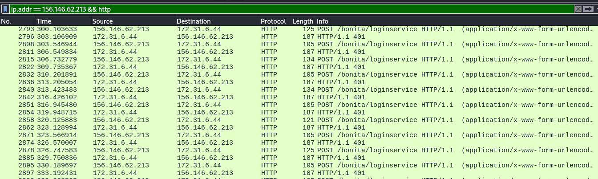

We see that this is a brute force attempt, all with their own username and passwords to try and obtain access, which is also called *credential stuffing*, check out [MITRE Brute Force - Credential Stuffing Technique](https://attack.mitre.org/techniques/T1110/004/).
- We can follow one of the TCP streams of one of these packets to inspect in depth what happens.
- Right click on one of the packets and choose follow then choose TCP stream, we get the following:

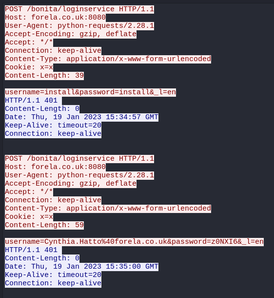

We see at first an attempt to login with username and password `install`, and then another trial with a normal username and password.
- This goes on for a while, until something abnormal happens.

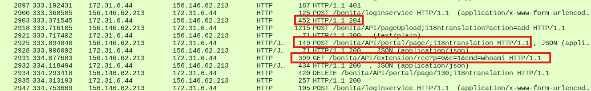

1. One of the `POST` requests returns a `204`, meaning that the credentials worked, and the attacker has successfully logged in.
2. We see a request to `/API/` with `;i18ntranslation` being added, which we saw in the description of the CVE above.
3. We see a request with a command being sent `whoami`.

Following the TCP stream of the successful login, we obtain a large amount of information.
- The correct credentials used:

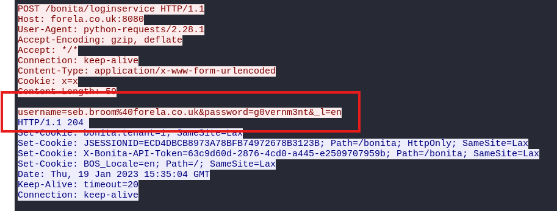

- The exploit taking place at the API endpoint, and a file being uploaded called `rce_api_extension.zip`.

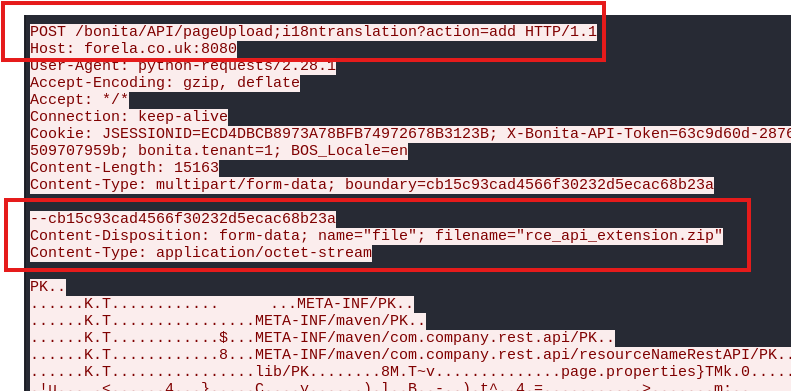

- And then, the RCE taking place after a while:

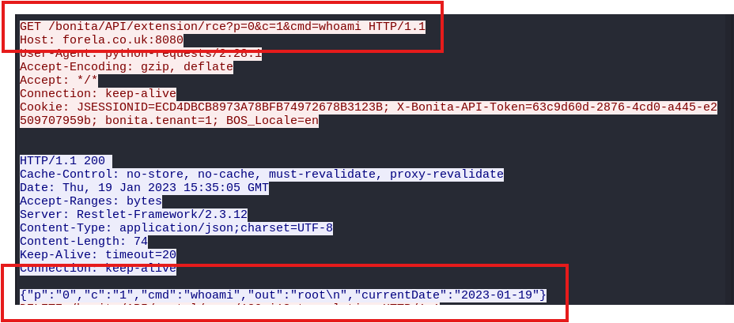

> We believe the attacker may have used a subset of the brute forcing attack category - what is the name of the attack carried out? `credential stuffing`.

### Task 3

> Does the vulnerability exploited have a CVE assigned - and if so, which one? : `CVE-2022-25237`

### Task 4

> Which string was appended to the API URL path to bypass the authorization filter by the attacker's exploit? : `i18ntranslation`.

### Task 5

To obtain the number of credentials used, we need to apply a rigorous Wireshark filter:
```
(ip.addr == 156.146.62.213 && http) && (_ws.col.info == "POST /bonita/loginservice HTTP/1.1  (application/x-www-form-urlencoded)") && frame.len != 105
```
- First, we keep the IP and protocol the same as above.
- Then, we right click on one of the `POST` request sent with the password and add it to filter.
- Finally, we need to remove the default credentials of `install:install` which don't count. I did that by checking the length of the packet with these credentials, which is always going to be the same, and said return all packet that are not that size, hence, `!= 105`.
- We get at the very bottom the number of packets displayed, which is 56.

> How many combinations of usernames and passwords were used in the credential stuffing attack? `56`.

### Task 6

We obtained them above, but to recap quickly, it is the content of the packet that has a response status of `204`.
- Opening that packet, we see the username and password.
```
Form item: "username" = "seb.broom@forela.co.uk"
Form item: "password" = "g0vernm3nt"
```

> Which username and password combination was successful? : `seb.broom@forela.co.uk:g0vernm3nt`.

### Task 7

Now, we obtained everything we can from that attacker's IP which we obtained from the alerts file.
- The RCE he had, he only utilized to to execute the command `whoami` as we showed above.

Trying the other IP which we saw above had the second most number of alerts, which was `138.199.59.221`, we can filter again on Wireshark.
```
ip.addr == 138.199.59.221 && http
```

We see that almost instantly, the attacker manages to successfully login with the correct credentials, and then does the exploit using the string we found above from the CVE link, and then does RCE.

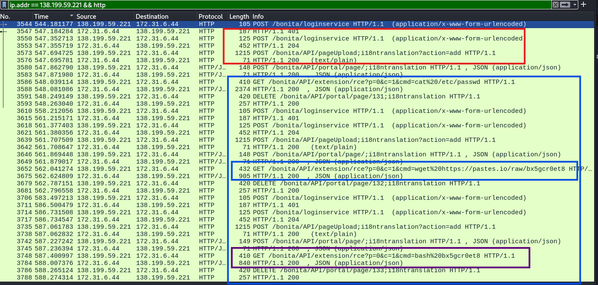

We see in the first small blue rectangle, RCE taking place with a `wget` command to `pastes.io/raw/bx5gcr0et8`.
- After a while, we see in the purple box that a command is sent to execute that file.

We can conclude that the attacker made a request to download a file from `pastes.io` and then runs its later to execute it.

> If any, which text sharing site did the attacker utilise? : `pastes.io`

### Task 8

Opening the link above to inspect the contents of that file.

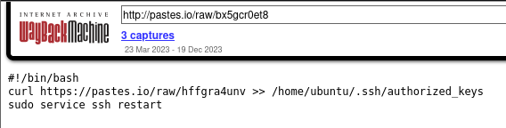

We see that this is a bash script file that then does another `wget` command to the file `hffgra4unv` on `pastes.io`, and then echoes the content of that file into the `authorized_keys` file.
- The `authorized_keys` file is a file used to contain the trusted SSH keys that allow people to SSH into that machine.
- Therefore, the file `hffgra4unv` is the file that contains the key of the attacker that will grant him persistence on the victim server, and he can SSH at any time into that machine.

> Please provide the filename of the public key used by the attacker to gain persistence on our host. : `hffgra4unv`.

### Task 9

> Can you confirm the file modified by the attacker to gain persistence? : `/home/ubuntu/.ssh/authorized_keys`.

### Task 10

Doing a quick google search on persistence using SSH keys, we get the following [Account Manipulation: SSH Authorized Keys](https://attack.mitre.org/techniques/T1098/004/).

> Can you confirm the MITRE technique ID of this type of persistence mechanism? : `T1098.004`

---
