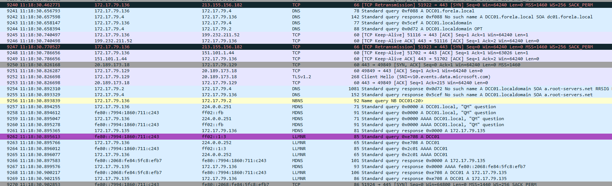
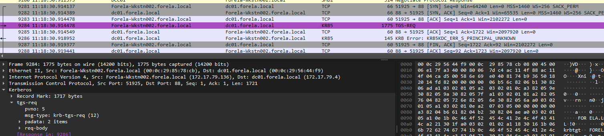
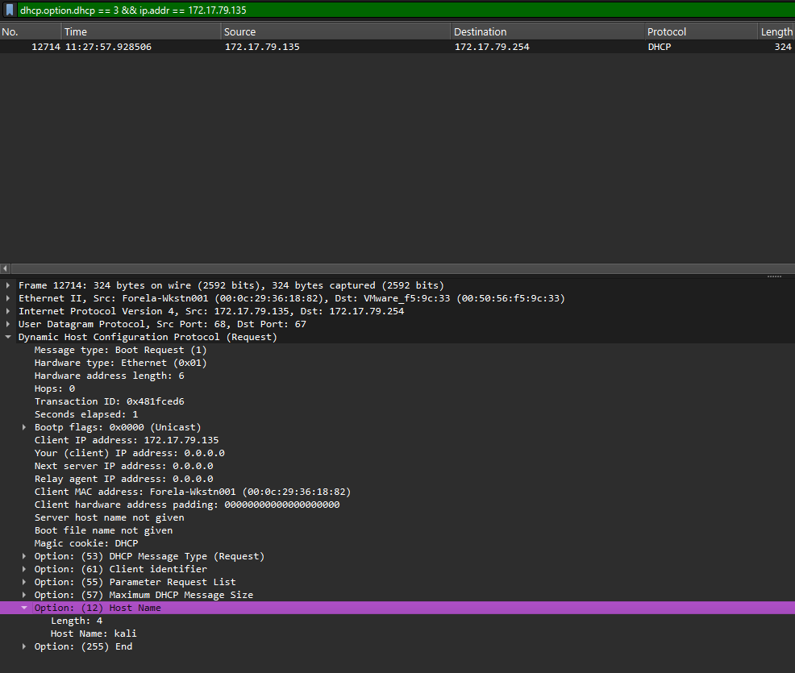
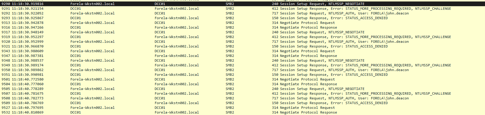
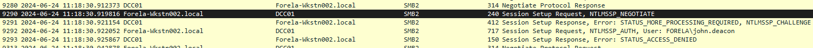
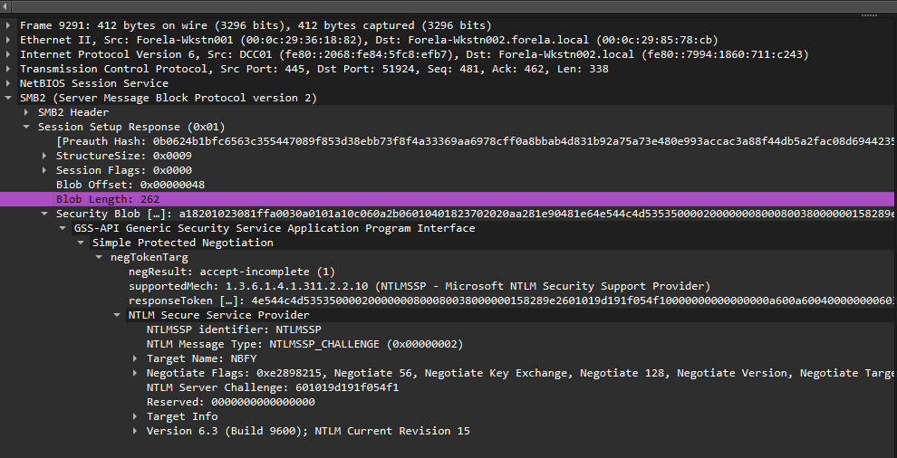
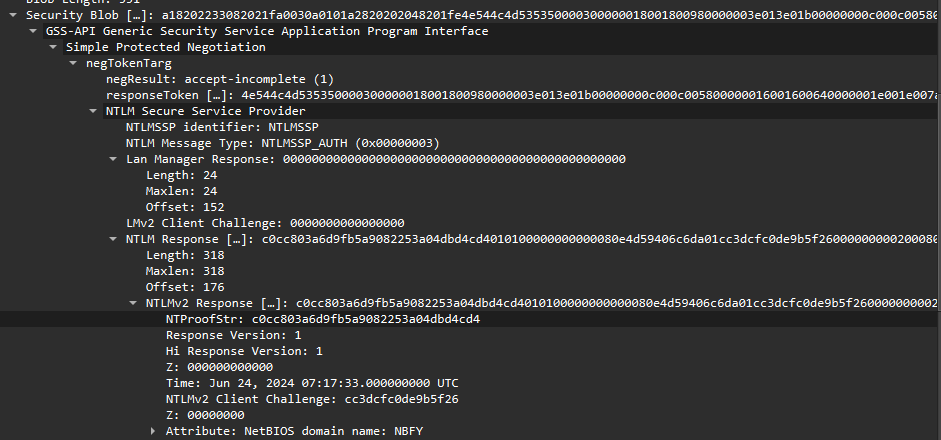
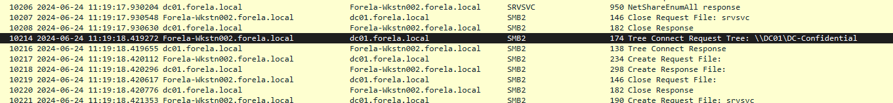

### Initial Analysis

First things first, I wanted to identify which hosts I need to focus on. I did that by filtering for `llmnr` traffic.
- Meaning, that a client will request queries, and a server will respond to them.
- The LLMNR poisoning therefore, is when a rogue server responds to the requests sent by the client.

LLMNR triggers when DNS fails.
- That is, when a DNS query is sent and it fails, the OS falls back to LLMNR to try and get a response.

Since we know that this is a LLMNR poisoning attack, the attack path follows this sequence:
- Victim tries to reach a hostname that does not resolve in DNS. Possibly a typo.
- LLMNR query is sent.
- Attacker runs a tool to respond to that query and claims they are the hostname entered by the victim.
- Victim trusts that the attacker is the hostname they need.
- The victim then starts NTLM authentication with the attacker.
- Attacker captures the necessary hashes & compromises the victim.

So what I did, was try to find the first instance where LLMNR happens.
1. Filter by `llmnr`.
2. Obtain the packet number of the first packet with `llmnr` -> `9262`
3. Remove the filter and go to the packet number number and check what happens before.
```
CTRL + G
9262
```



We see here the following:
1. `9241` we see the host `172.17.79.136` making DNS requests for `DCC01.forela.local`
2. `9242` we see that there is no such name.
3. Then, the host tries again in packet `9256` using `NBNS`, then tries using `MDNS` in packet `9257`.
4. Finally, it tries `LLMNR` in packet `9262`.

Now, we see that in packet `9263`, the host `172.17.79.136` is requesting for the hostname `DCC01`. And we see it again in packet `9265`.
- Then, we see replies coming from `172.17.79.135` stating that `DCC01` is present at its IP address.
- This exact scenario happens more than once.

Then, we see Kerberos traffic, which is indicative of the Domain Controller, as it is responsible for handing out the necessary Kerberos tickets.
- This is present in packet `9284` where we see communication with IP `172.17.79.4` with request for `TGS-REQ`.
- If we do name resolution, we see that it is called `dc01.forela.local`.



### Task 1

We know that the client host is `172.17.79.136` with the name `Forela-WKstn002` from the question.
- And we know from the initial analysis that there is an IP `172.17.79.135` that is replying.
- We know that there is a malicious host responding to the requests maliciously.

To check, we can filter for all `llmnr` traffic and see what's going on.
- Every single response is carried out by the IP `172.17.79.135`, and it is claiming to be `DCC01` in all of them.
- If we enable name resolution, we see that this IP address is called `Forela-Wkstn001`.
- Hence, this host is claiming to be a host it is not.

Since we also know that the IP `172.17.79.4` with hostname `dc01.forela.local` is the Domain Controller as it replies to the Kerberos requests, we know that `.135` is not the Domain Controller, ruling out that option.
- Another check is to view the DNS responses, and see that they are originating from the `172.17.79.4` IP, ensuring that it is in fact the Domain Controller.
- Domain Controllers are the DNS servers.

> Its suspected by the security team that there was a rogue device in Forela's internal network running responder tool to perform an LLMNR Poisoning attack. Please find the malicious IP Address of the machine. : `172.17.79.135`.

### Task 2

To identify the hostname of this machine, we can check DHCP Request packets.
```
ip.addr == 172.17.79.135 && dhcp.option.dhcp == 3
```
- We can then check the host name option in the packet details.



We see that the hostname is `kali`.

> What is the hostname of the rogue machine?: `kali`.

#### Checkpoint

Now, we know that `DCC01` was needed, and the attacker `172.17.79.135` responded claiming they are `DCC01`.
- The next step would be for the attacker and the victim, `172.17.79.136`, to perform NTLM authentication so the attacker can to try and obtain the hash of the victim.

To identify NTLM authentication, we need to filter for `ntlmssp` to showcase the NTLM negotiate, challenge, and authenticate packets of the handshake.
- The same can be done by filtering for SMB traffic using `smb2`.

### Task 3

If we filter for `smb2`, we see the NTLM authentication flow several times between the victim and the pretend `DCC01`.



From here, we see that the authentication fails, but we see the username `FORELA\john.deacon`.

> Now we need to confirm whether the attacker captured the user's hash and it is crackable!! What is the username whose hash was captured? `john.deacon`

### Task 4

To check the first time the hash was captured, we need to use the first `NTLMSSP_AUTH` packet's timestamp as this contains the hash we are looking for.
- However, we need to ensure the timezone is set to UTC Date from `view > time display format`.



> In NTLM traffic we can see that the victim credentials were relayed multiple times to the attacker's machine. When were the hashes captured the First time? `2024-06-24 11:18:30`.

### Task 5

Since the LLMNR only starts when DNS fails to find a response, this was triggered when the victim tries searching for `DCC01`, which we can assume was meant to be `DC01`.

> What was the typo made by the victim when navigating to the file share that caused his credentials to be leaked? : `DCC01`.

### Task 6

To obtain the challenge value, we can check out the `NTLMSSP_CHALLENGE` packet, or packet number `9291`.
- We can then expand `Session Setup Response > Security Blob > ... > NTLM Secure Service Provider > NTLM Server Challenge`.



> To get the actual credentials of the victim user we need to stitch together multiple values from the ntlm negotiation packets. What is the NTLM server challenge value? `601019d191f054f1`

### Task 7

To view the `NTProofStr`, we need to use the `NTLMSSP_AUTH` packet, or packet number `9292`.



> Now doing something similar find the NTProofStr value. `c0cc803a6d9fb5a9082253a04dbd4cd4`

### Task 8

To get the password, we have to get the full hash which is composed of the following:

```
<username>::<domain>:<Challenge>:<NTProofStr>:<Blob>
```
- we are missing the `blob`, which is the value of the NTLMv2 Response without the first 16 bytes which contain the `NTProofStr`. This value can be obtained from the same location as the `NTProofStr` packet.

```
010100000000000080e4d59406c6da01cc3dcfc0de9b5f2600000000020008004e0042004600590001001e00570049004e002d00360036004100530035004c003100470052005700540004003400570049004e002d00360036004100530035004c00310047005200570054002e004e004200460059002e004c004f00430041004c00030014004e004200460059002e004c004f00430041004c00050014004e004200460059002e004c004f00430041004c000700080080e4d59406c6da0106000400020000000800300030000000000000000000000000200000eb2ecbc5200a40b89ad5831abf821f4f20a2c7f352283a35600377e1f294f1c90a001000000000000000000000000000000000000900140063006900660073002f00440043004300300031000000000000000000
```

Now, we can construct the hash:
```
john.deacon::FORELA:601019d191f054f1:c0cc803a6d9fb5a9082253a04dbd4cd4:010100000000000080e4d59406c6da01cc3dcfc0de9b5f2600000000020008004e0042004600590001001e00570049004e002d00360036004100530035004c003100470052005700540004003400570049004e002d00360036004100530035004c00310047005200570054002e004e004200460059002e004c004f00430041004c00030014004e004200460059002e004c004f00430041004c00050014004e004200460059002e004c004f00430041004c000700080080e4d59406c6da0106000400020000000800300030000000000000000000000000200000eb2ecbc5200a40b89ad5831abf821f4f20a2c7f352283a35600377e1f294f1c90a001000000000000000000000000000000000000900140063006900660073002f00440043004300300031000000000000000000
```

To uncrack this hash, we can use a tool like `hashcat`.
1. Identify the `hashcat` cracking type. 

```
└─$ hashcat --help | grep NTLMv2
   5600 | NetNTLMv2                                    | Network Protocol
```

2. Place the hash in a file to be given as input:

```
echo "john.deacon::FORELA:601019d191f054f1:c0cc803a6d9fb5a9082253a04dbd4cd4:010100000000000080e4d59406c6da01cc3dcfc0de9b5f2600000000020008004e0042004600590001001e00570049004e002d00360036004100530035004c003100470052005700540004003400570049004e002d00360036004100530035004c00310047005200570054002e004e004200460059002e004c004f00430041004c00030014004e004200460059002e004c004f00430041004c00050014004e004200460059002e004c004f00430041004c000700080080e4d59406c6da0106000400020000000800300030000000000000000000000000200000eb2ecbc5200a40b89ad5831abf821f4f20a2c7f352283a35600377e1f294f1c90a001000000000000000000000000000000000000900140063006900660073002f00440043004300300031000000000000000000" > hash
```

3. Run hashcat with wordlist like `rockyou.txt`

```
hashcat -m5600 -a0 hash /usr/share/wordlists/rockyou.txt 
```

We get the output:

```
JOHN.DEACON::FORELA:601019d191f054f1:c0cc803a6d9fb5a9082253a04dbd4cd4:010100000000000080e4d59406c6da01cc3dcfc0de9b5f2600000000020008004e0042004600590001001e00570049004e002d00360036004100530035004c003100470052005700540004003400570049004e002d00360036004100530035004c00310047005200570054002e004e004200460059002e004c004f00430041004c00030014004e004200460059002e004c004f00430041004c00050014004e004200460059002e004c004f00430041004c000700080080e4d59406c6da0106000400020000000800300030000000000000000000000000200000eb2ecbc5200a40b89ad5831abf821f4f20a2c7f352283a35600377e1f294f1c90a001000000000000000000000000000000000000900140063006900660073002f00440043004300300031000000000000000000:NotMyPassword0k?
```

And we see the password is `NotMyPassword0k?`.

> To test the password complexity, try recovering the password from the information found from packet capture. This is a crucial step as this way we can find whether the attacker was able to crack this and how quickly. `NotMyPassword0k?`

### Task 9

Moving through the packets with `smb2` filter, we see later that victim manages to connect to the real domain controller, and later requests the following file:
```
\\DC01\DC-Confidential
```



> Just to get more context surrounding the incident, what is the actual file share that the victim was trying to navigate to? `\\DC01\DC-Confidential`

---
