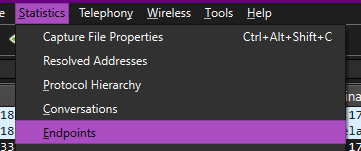
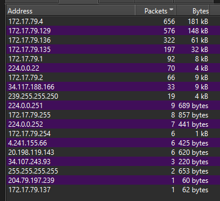
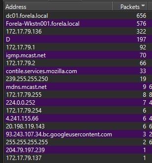
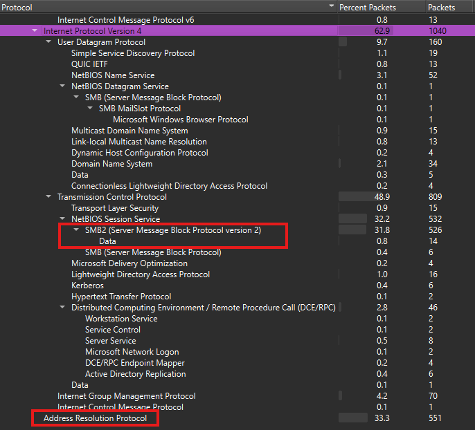

---
### Initial Analysis of PCAP

First thing I did was open the `pcap` file using Wireshark, then I enabled name resolution for the network address:

> That way, we can determine if Wireshark mapped the names of the machines with their IP addresses by inspecting the packets present.

Opening the Statistics tab, then choosing endpoints, and navigating to IPv4, we can now observe the machines and their IP addresses:

I sorted by the *Packets* tab, and clicked on the left checkbox for Name resolution, we can see that we see the first 2 IP addresses and their names:
- `172.17.79.4 : dc01.forela.local` -> This is the Domain Controller
- `172.17.79.129 : Forela-Wkstn001.forela.local` -> This is the interesting workstation
- `172.17.79.135 : D` -> This name is weird, lets keep it in note.

Next, I opened the *Protocol Hierarchy* tab under *Statistics* as well to check out the type of communication present in the `pcap`:

> We see that mainly SMB traffic is present as well as ARP traffic.

Opening the PCAP now, we see that the first packets we see are all ARP packets being sent out by the IP address `172.17.79.135` as if trying to discover the network, is sent to the entire IP address network range.
- This is the machine whose name is `D`.
- We get a few responses, mainly for the Forela-Wkstn001 we discovered, as well as the domain controller, and a few other virtual machines.

##### Assessing `NBNS` - NetBIOS

We also see scattered throughout the protocol `NBNS` protocol sending out *Refresh* packets.
- Doing a quick search, Refresh packets are used to ensure that the computer maintains the same name-IP mapping.
- This is a protocol that serves a similar function to DNS, by mapping IP addresses to machine names.
- From here, we can confirm the following intuition we found earlier from Wireshark about the computer names and their IP addresses.

Opening a packet from these and expanding the NBNS section, we see the following:

![[Reaper-5.png]]

This shows that the name of the machine `FORELA-WKSTN-001` is refreshing its IP address of `172.17.79.129`. We see the following IPS:
- `172.17.79.129` -> `FORELA-WKSTN-001`
- `172.17.79.136` -> `FORELA-WKSTN-002`
- `172.17.79.1` -> `PK-DEV-JSTARK`
- `172.17.79.4` -> `DC`

We also notice how in the `NBNS` packets, a few them are sent out by the `172.17.79.135` machine we though was suspicious for discovering the network, which had the name `D`.
- We see that it sends out a few `NBNS` query packets to destination IPs, as if to determine their information:

![[Reaper-6.png]]

If we open the first packet for example, we see that it sends a NBNS query to the `.1` IP address:
- This query is of type `NBSTAT` which is a legitimate query type to retrieve the NetBIOS names registered on a host.
- The query name consisting of the `*<00><00>...` is the NetBIOS wildcard name which returns the status of all the NetBIOS names registered on the host.
- This means that the `.135` machine is asking the `.1` machine about all of the NetBIOS names it has and their status, which adds to the discovery of the network.

![[Reaper-8.png]]

The response from the `.1` IP address is then:

![[Reaper-7.png]]

This shows the name of the machine being `PK-DEV-JSTARK`, is part of a local windows `WORKGROUP`, and has the *SMB* service as shown by the `<20>` suffix. 

> This is the case for the other machines it has reconned as shown in this table:

| Hostname & IP     | IP            | Domain / Workgroup | NetBIOS Names Returned                                                                | Roles / Services Identified                                                                                                      |
| ----------------- | ------------- | ------------------ | ------------------------------------------------------------------------------------- | -------------------------------------------------------------------------------------------------------------------------------- |
| **PK-DEV-JSTARK** | 172.17.79.1   | WORKGROUP          | PK-DEV-JSTARK `<00>`   WORKGROUP `<00>`   PK-DEV-JSTARK `<20>`                  | `<00>` Workstation service   `<20>` SMB Server service                                                                        |
| **WKSTN001**      | 172.17.79.129 | FORELA             | FORELA `<00>`   WKSTN001 `<00>`   WKSTN001 `<20>`                               | `<00>` Workstation service   `<20>` SMB Server service                                                                        |
| **DC01**          | 172.17.79.4   | FORELA             | DC01 `<00>`   FORELA `<00>`   FORELA `<1C>`   DC01 `<20>`   FORELA `<1B>` | `<00>` Workstation service   `<20>` SMB Server service   `<1C>` Domain Controllers group   `<1B>` Domain Master Browser |

Ok, i got a bit carried away. I think its time to answer the questions lol.

---
### Task 1

> What is the IP Address for Forela-Wkstn001?: `172.17.79.129`

---
### Task 2

> What is the IP Address for Forela-Wkstn002?: `172.17.79.136`

---
### Task 3

Knowing that the suspicious IP is this one `172.17.79.135` due to its weird activities and its name and not being involved in the domain, we can assume that it is the attacker machine.

Now, we can look through the `pcap` at the *SMB* conversations and look for our IP address.

![[Reaper-10.png]]

We see here that the suspicious IP tries to connect to both `.136` and `.129` with the `FORELA\arthur.kyle` username, and then we scroll down a bit, we see both IPs are communicating via SMB with the `.135` machine, indicating the connection works.
- Hence, the attacker has access to this user and is using it to connect to different workstations (WKSTN-1) and (WKSTN-2) and reading data.

![[Reaper-11.png]]

> What is the username of the account whose hash was stolen by attacker? `arthur.kyle`.

---
### Task 4

> What is the IP Address of Unknown Device used by the attacker to intercept credentials? `172.17.79.135`

---
### Task 5

