Opening the log file in Event Viewer by clicking on *Open Saved Log...* on the right *Actions* bar. 
### Task 1

We can filter by Event ID `11`, which is the event ID for file creation, in Event Viewer by clicking on *Filter Current Log* in the right *Actions* bar.
- Writing `11` in the Event ID placeholder and clicking apply will give us what we want.

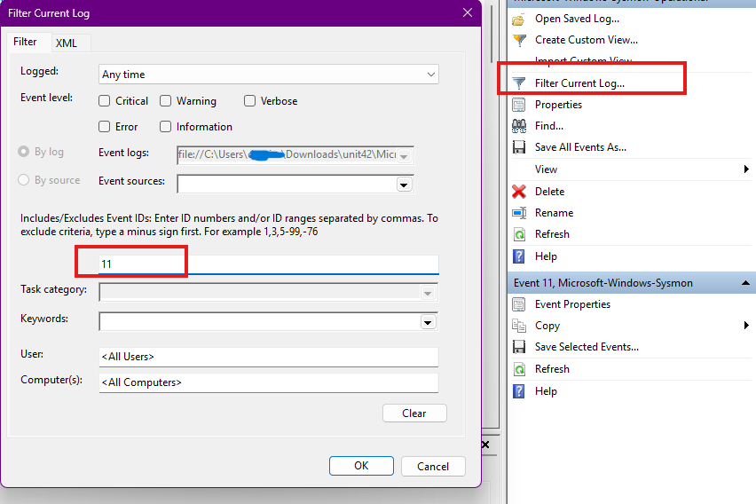

We see that there are `56` events output from the filter.

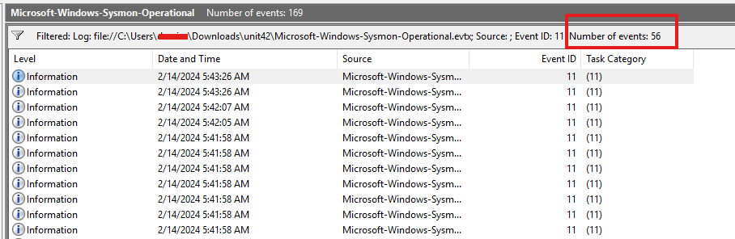

> How many Event logs are there with Event ID 11? : `56`.

### Task 2

The first thing we do is we filter using the same method in [[#Task 1]] for the Event ID 1.
- We see there are 6 events returned.

Skimming through these events and using the `Details` tab at the bottom, we see the `Image` field.
- This is where the process name will show up.

Scrolling through, we see several process but one of them stands out:
- The directory where it is running from is suspicious, and if we copy the hash to virus total, we see that it is in fact malicious.

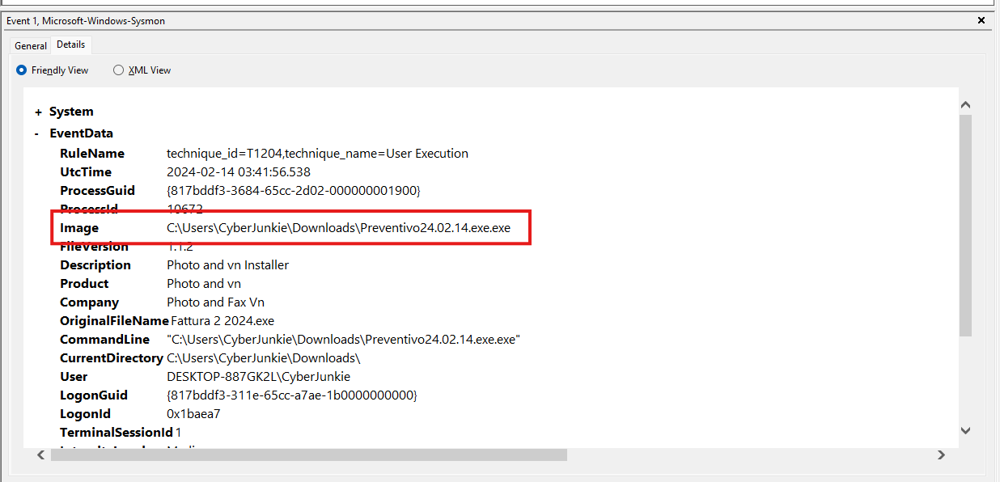

To do the same process but from the command line using `Get-WinEvent` which will be easier, we can execute the following command:
```powershell
Get-WinEvent -Path C:\path-to-file\unit42\Microsoft-Windows-Sysmon-Operational.evtx -FilterXPath "*/System/EventID = 1" |

ForEach-Object {
    
    [xml]$xml = $_.ToXml()
    
    $utcTime = $xml.Event.EventData.Data | Where-Object { $_.Name -eq "UtcTime" } | Select-Object -ExpandProperty '#text'
    $image   = $xml.Event.EventData.Data | Where-Object { $_.Name -eq "Image" }   | Select-Object -ExpandProperty '#text'
    
    Write-Output "UtcTime : $utcTime"
    Write-Output "Image   : $image"
    Write-Output "`n"
}
```
- First thing we do is we filter to get only events with ID `1` using XPath.
- Then for each object, or for each event log, we convert it to XML to be able to parse it easily.
- We get the `utcTime` value and the `Image` value, and then we print them.
- If we check the XML view in the details pane in Event Viewer, we will see that both `Image` and `utcTime` are under `Event` then `EventData`, and each of them is in an element called `Data`. The only difference is the value of the `Name` attribute, which is what we are checking for.

We can do the exact same thing with this simpler command:
```powershell
Get-WinEvent -Path C:\path-to-file\unit42\Microsoft-Windows-Sysmon-Operational.evtx -FilterXPath "*/System/EventID = 1" |
ForEach-Object {
    $utcTime = $_.Properties[1].Value
    $image   = $_.Properties[4].Value

    Write-Output "UtcTime : $utcTime"
    Write-Output "Image   : $image"
    Write-Output "`n"
}
```

Running this command we get this output:
```powershell
UtcTime : 2024-02-14 03:41:58.178
Image   : C:\Windows\SysWOW64\msiexec.exe


UtcTime : 2024-02-14 03:41:57.905
Image   : C:\Windows\SysWOW64\msiexec.exe


UtcTime : 2024-02-14 03:41:57.787
Image   : C:\Windows\SysWOW64\msiexec.exe


UtcTime : 2024-02-14 03:41:57.604
Image   : C:\Windows\System32\msiexec.exe


UtcTime : 2024-02-14 03:41:56.538
Image   : C:\Users\CyberJunkie\Downloads\Preventivo24.02.14.exe.exe


UtcTime : 2024-02-14 03:41:45.304
Image   : C:\Program Files\Mozilla Firefox\pingsender.exe
```
- We see that the first 4 are `msiexec.exe` (when there is a lot of something it means it is normal), then there's the suspicious one running from the Downloads directory, then there is some Firefox application running.

> Whenever a process is created in memory, an event with Event ID 1 is recorded with details such as command line, hashes, process path, parent process path, etc. This information is very useful for an analyst because it allows us to see all programs executed on a system, which means we can spot any malicious processes being executed. What is the malicious process that infected the victim's system? : `C:\Users\CyberJunkie\Downloads\Preventivo24.02.14.exe.exe
`

### Task 3

Now, we need to find from where the malware was installed on the device.
1. We can do that by finding the first Event ID `11` log recorded with the  `TargetFilename` being `C:\Users\CyberJunkie\Downloads\Preventivo24.02.14.exe.exe`.
2. Once we find that event, we can record its time, and then look at the logs that are produced around this time that point to network connections, file downloads, and so on.

The first log with Event ID 11 and being for `Preventivo` is at `5:41:26`:

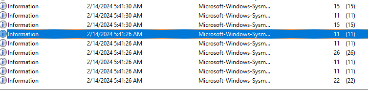

In the neighboring time frame, we see event IDs `22:DNSEvent` and `15:FileCreateStreamHash`.

For EventID 22:
- The log with EventID 22 means that there was a DNS query sent, and then right after that, several EventID 11s are found. Opening these, we see that this is a temporary file being created, possibly hinting at the temporary name given to files while they download. Also, we see that the Image being used is Firefox, a browser, which helps our theory.

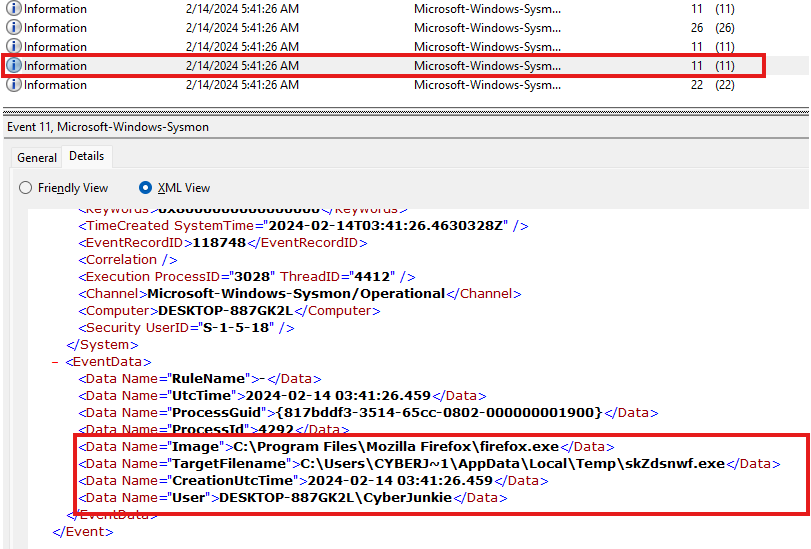

- Then, we see EventID 26, which means that a file was deleted, and if we open the log itself, it will be the temporary file name being deleted.

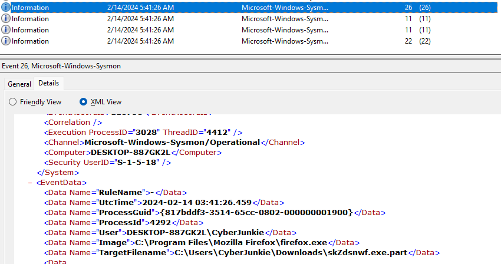

- Then, we see our event after it with the file creation for `Preventivo`. 

This leads to me conclude that a file was downloaded using Firefox, and that file was `Preventivo`.
- Opening the log with EventID 22 to check it out:

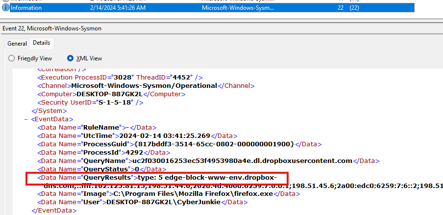

We see that `dropbox` was queried.
- We can conclude that `dropbox` is the cloud provider in use.

We can also take a look at the EventID `15`, which is for FileCreateStreamHash. This log contains browser information to help us identify if a malware was downloaded via the browser.
- Since this log is in the neighboring time, we open it.

The first one with ID 15 is not of use, but the second one has the `Zone.Identifier` that helps us understand more about this file download.

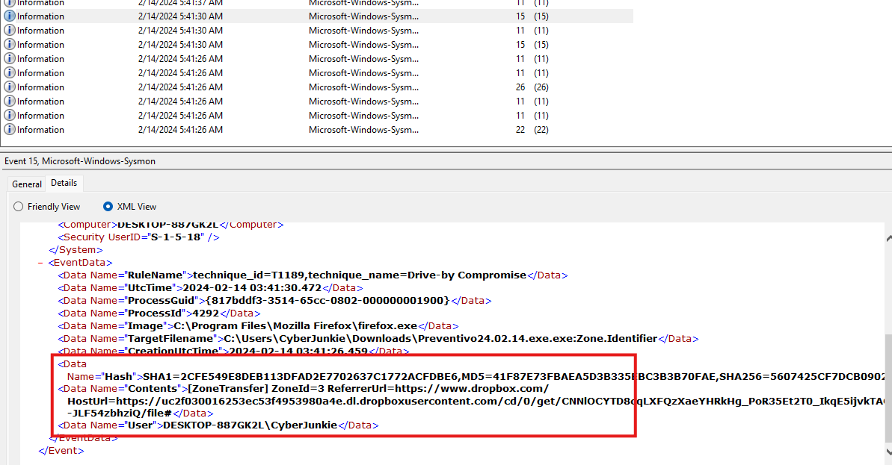

We see that dropbox.com in the `Referrer` header, and in the download link, or `HostUrl`, for the file.
- Therefore, we can confirm that `dropbox` was used to download the malicious file.

> Which Cloud drive was used to distribute the malware?: `dropbox`

### Task 4

To look for time stomping, or changing the file creation date, we can filter for Sysmon EventID `2` using the same technique in [[#Task 1]].
- We get a list of 16 events.

Going through each one and checking the `TargetFilename` field, we see an event that has a `pdf` file.

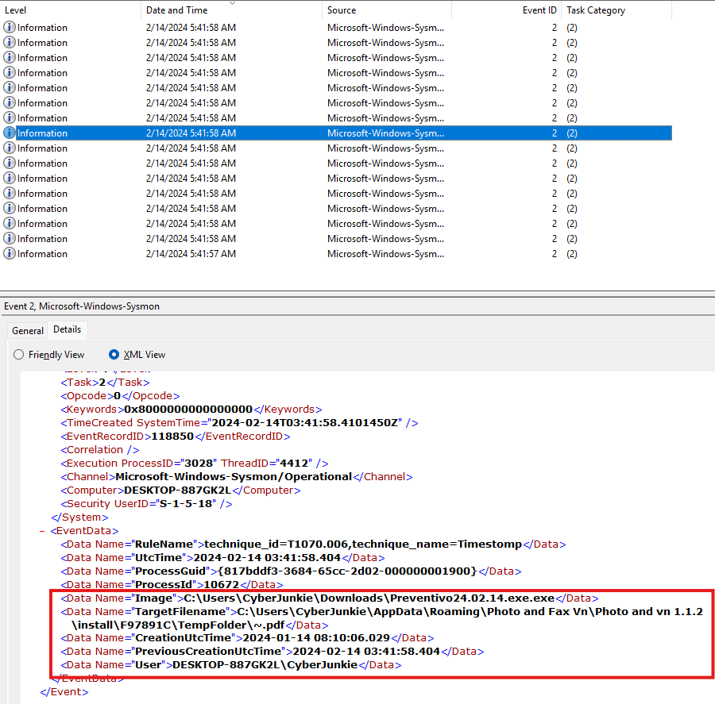

> For many of the files it wrote to disk, the initial malicious file used a defense evasion technique called Time Stomping, where the file creation date is changed to make it appear older and blend in with other files. What was the timestamp changed to for the PDF file? : `2024-01-14 08:10:06`.

### Task 5

Since a file was dropped on disk, this means that it has to have been created.
- Filtering for Event ID 11, which is file creation logs, and sifting through until we see a `TargetFilename` that has `once.cmd`.

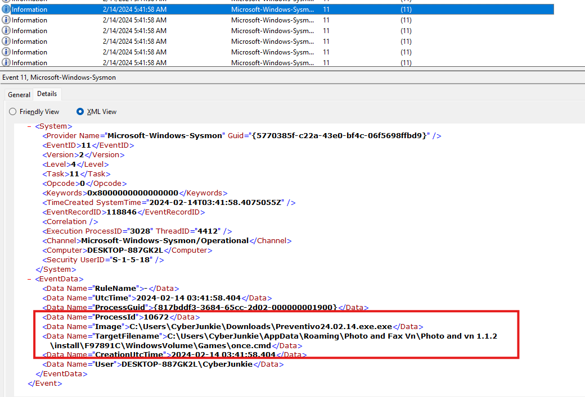

> The malicious file dropped a few files on disk. Where was "once.cmd" created on disk? Please answer with the full path along with the filename:  `C:\Users\CyberJunkie\AppData\Roaming\Photo and Fax Vn\Photo and vn 1.1.2\install\F97891C\WindowsVolume\Games\once.cmd`

### Task 6

Since we are looking for a network connection, I used EventID 3, but got nothing useful about a domain:

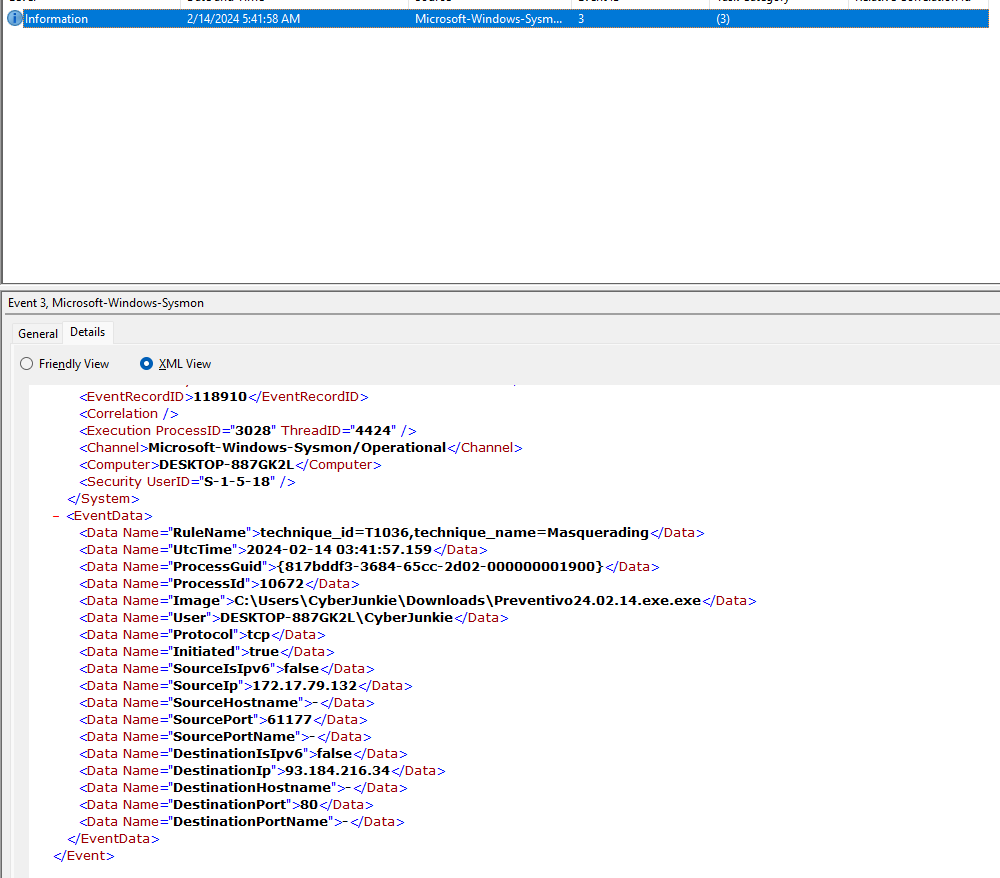

The other event ID that could hint at a network connection is the DNSQuery EventID of 22, so trying that:

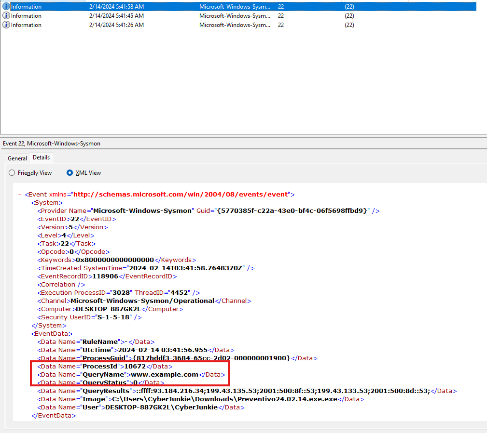

We see that in one of them, there is a query made to `www.example.com`, which is probably just a check to make sure that there is network connection.
- We also see that the Image doing that is the same malicious file we found earlier.

> The malicious file attempted to reach a dummy domain, most likely to check the internet connection status. What domain name did it try to connect to? : `www.example.com`.

### Task 7

The IP address we found in the task above when we filtered for EventID 3.


> Which IP address did the malicious process try to reach out to? : `93.184.216.34`.

### Task 8

To look for process terminations, we can filter for EventID 5.
- Doing that, we get one record with a timestamp.

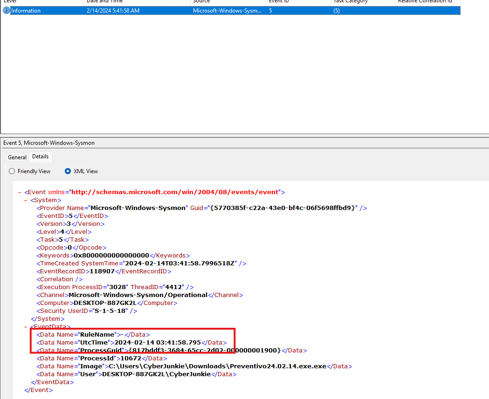

> The malicious process terminated itself after infecting the PC with a backdoored variant of UltraVNC. When did the process terminate itself? : `2024-02-14 03:41:58`

---
