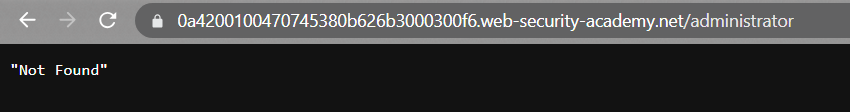
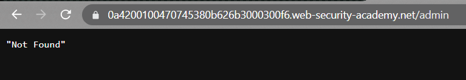
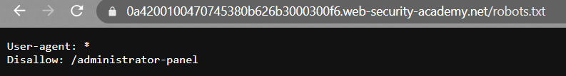
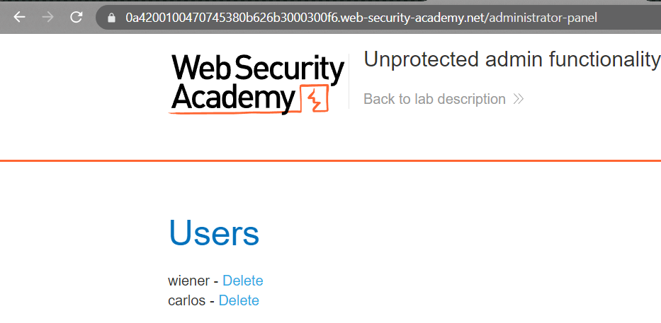

### Unprotected admin functionality : APPRENTICE

---

> We have an unprotected functionality.
> We can check for the admin panel page by inserting it into the URL.

> Trying `admin`, `administrator`.

> Since both didn't work, we can try to look for the disclosed functionality in the `robots.txt` directory.

> We see that the admin page can be visited by accessing the `administrator-panel` directory.
> Entering this directory into the URL and we access the admin page.

> Deleting carlos completes the lab.

---
