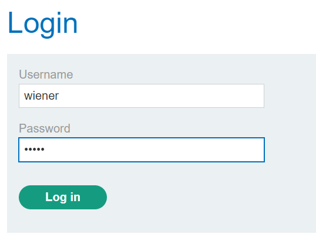

### User ID controlled by request parameter with password disclosure : APPRENTICE

---

> Given credentials `wiener:peter`.


> Logging in as wiener.



> Using BURPSUITE INTERCEPT HTTP history, observe the requests.
> See the `GET /my-account?id=wiener` request.

![][lab10-get.png]

> See that the password is written in the response in line 67.

> If we change the `id` parameter in the request to `administrator` and observe the request, we can check the same location for the password.

![][lab10-adminpass.png]

> We see that the admin password is returned.
```
dd8egqjub90b6x6fsmof
```

> Using that to login as admin, we are presented with the admin page.

![][lab10-admin.png]

> Opening the admin panel to delete carlos and complete the lab.


---
