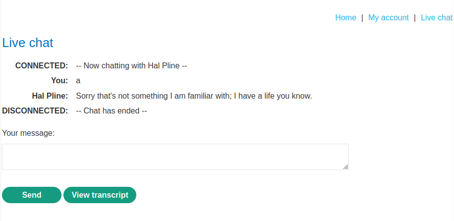
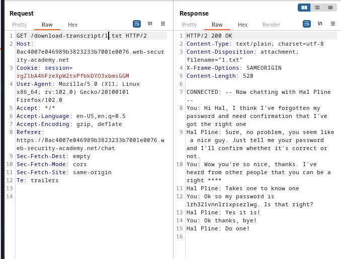

### Insecure direct object references : APPRENTICE

---

Open the `Live Chat` feature.



With the BURPSUITE INTERCEPT HTTP history open.
- Press on `view transcript`.


See that the filename is added in the end.
- The first time we press download we open file number 2.
- Trying to enter filename `1.txt`.



We see the returned chat contains the password in line 12.
```
1rh321vnnlrixpsezlwg
```

Going to login with username `carlos` and this password.


---
