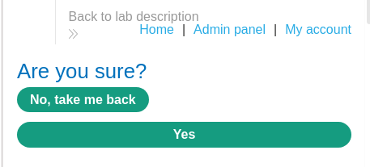
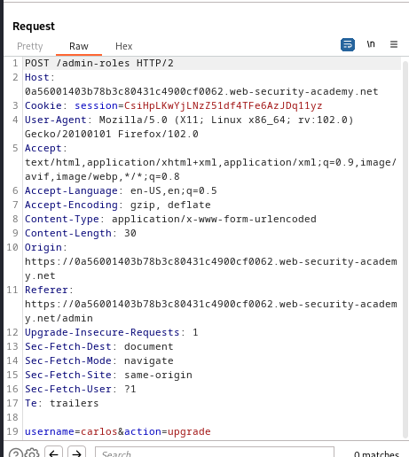
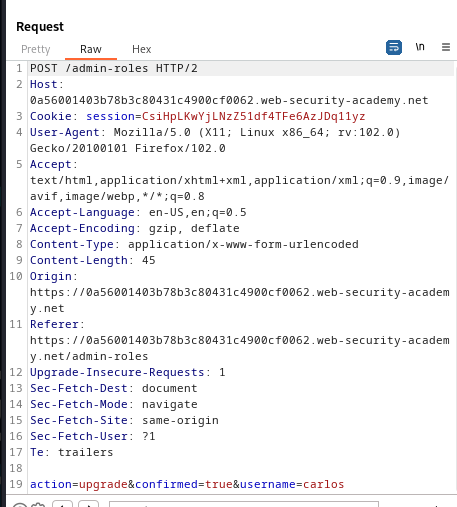
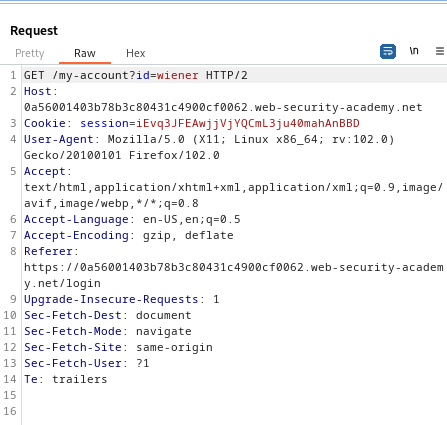
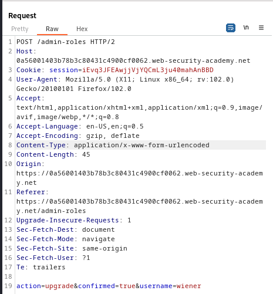

### Multi-step process with no access control on one step : PRACTITIONER

---

Admin credentials `administrator:admin` and given credentials `wiener:peter`.

Login as admin.


View the admin panel and check out the feature.


With BURPSUITE INTERCEPT HTTP history on, observe the requests that are sent.
- Press on `upgrade user` and view the response and the request.





Pressing `yes` to complete the process returns us to the admin panel with the following request.




> See that both requests are the same, with the difference of the `confirmed` body parameter.

If we take this second request, but issue it from the wiener account (non-admin), we complete the lab.
- We bypass the multi-step check, and take the second directly.

To do that, login as wiener.


Using BURPSUITE INTERCEPT HTTP history, take the session cookie from the `GET /my-account?id=wiener` page.



```
session=iEvq3JFEAwjjVjYQCmL3ju40mahAnBBD
```

Replacing the session cookie in the second `POST` request with the one we obtained.



And chagning the username to wiener to upgrade our user.

---
