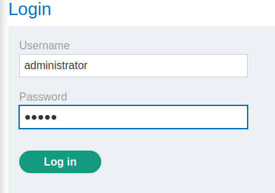

### Referer-based access control : PRACTITIONER

---


> Admin credentials `administrator:admin`.
> Given credentials `wiener:peter`.

> Login as admin.



> View the admin panel and check out the feature.


> With BURPSUITE INTERCEPT HTTP history on, observe the requests that are sent.


> The `referer` header is used and its value is the `/admin` page.
> So if we try to access this page as wiener but leave the `referer` header, maybe we can access this page.

> To do that, login as wiener and capture the session cookie from the `GET /my-account?id=wiener` request.


```
session=idiX4zayhwcdvRHFRDqVuabCdVrnc4MX
```

> Replacing the session cookie in the `POST` request with this one, and changing the `username` parameter to wiener to upgrade wiener.


> Sending the request works, and the lab is complete.

---
