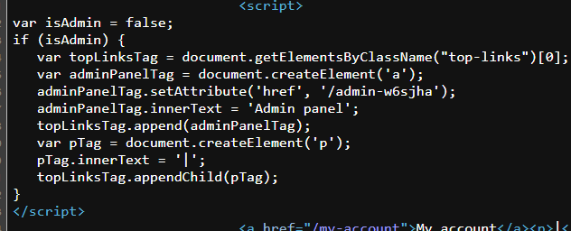
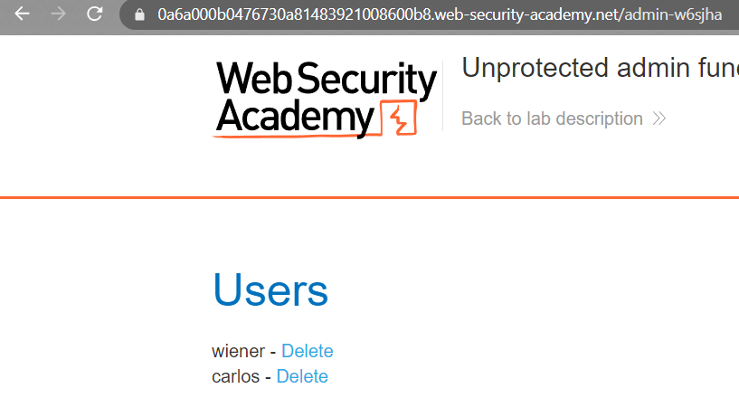

### Unprotected admin functionality with unpredictable URL : APPRENTICE

---

> We have an unprotected functionality.
> We can check for it by looking in the source code of the web app.

> Skimming through, there is a JavaScript script present that performs certain actions if the user is an admin.



> We see there is a link to a directory that might possibly be the admin page.
```
/admin-w6sjha
```

> Accessing this directory through the URL.
> We are greeted with the admin page.



> Deleting the user carlos completes the lab.

---
