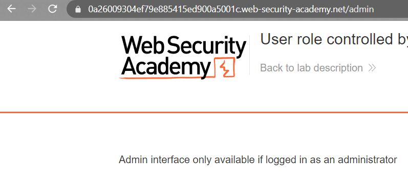
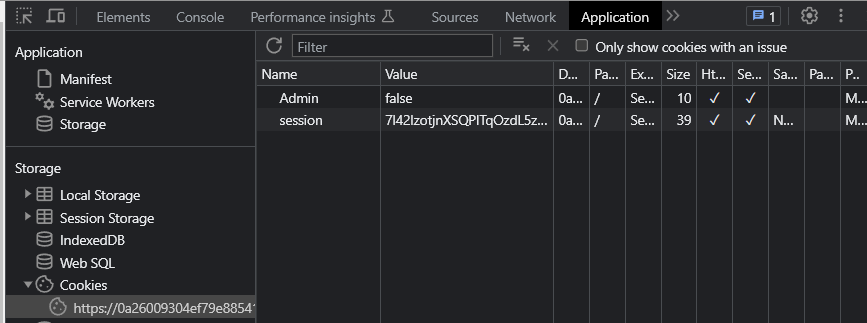
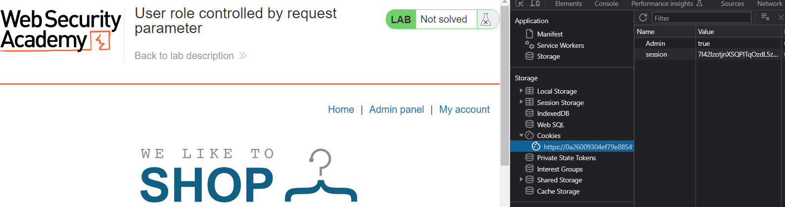

### User role controlled by request parameter : APPRENTICE

---

Given credentials `wiener:peter`.
- Can access the admin page at `/admin`.

Trying to access the admin page at `/admin`.

> Doesn't work. So trying to login as wiener and then elevating to admin from there.

Once we are logged in, we can check the cookies that are present in the browser.
- Opening developer tools > application > storage > cookies.

We see an `admin` cookie that is set to false.
- Changing its value to `true` and then reloading the home page could elevate our privileges.

We now have access to the admin panel.

We see that it is in the URL directory that was given at the beginning.
- Deleting the user carlos completes the lab.

---

