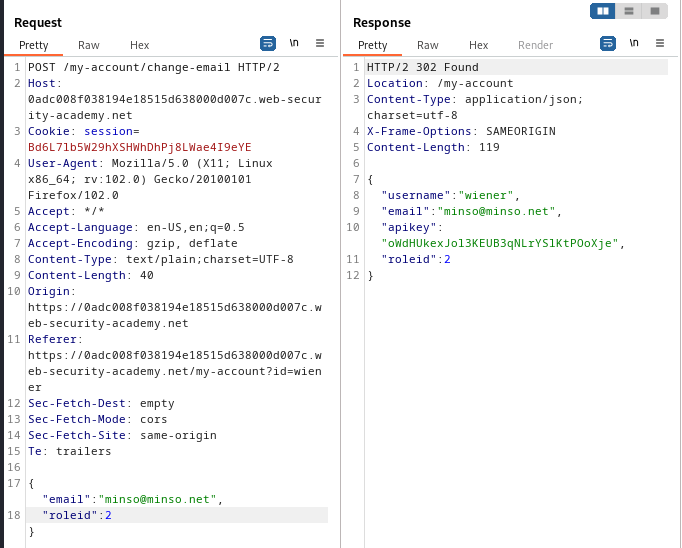

### User role can be modified in user profile : APPRENTICE

---

> Given credentials `wiener:peter`.
> Can access the admin page at `/admin` only with `roleid=2`.

> Loggin in as `wiener`.

> There are no cookies, hidden body parameters, or query strings that exist.
> Trying the change email feature to check for these data stores.

> With BURPSUITE PROXY HTTP History on, we see a `POST` request is sent to change email.

> We see that in the response, there is a key-value store with `"roleid"=1`.
> Sending this request to BURPSUITE REPEATER and adding in the JSON body parameter `"roleid":2` and sending it.

> Refreshing the page in the browser, we see the admin panel button is now visible.

> Opening it and deleting the user carlos completes the lab.

---

