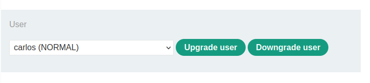
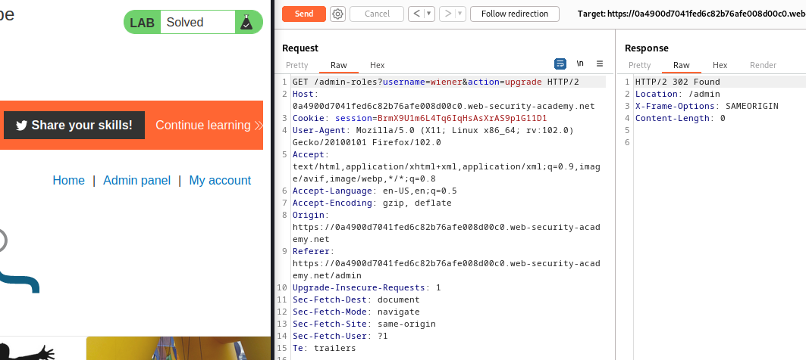

### Method-based access control can be circumvented : PRACTITIONER

---

Administrator credentials `administrator:admin` and given credentials `wiener:peter`.
- Login as admin to test the functionality.


Checking out the admin panel, we can upgrade or downgrade users.



With BURPSUITE INTERCEPT HTTP history, monitor the requests that are sent when a user is upgraded.


> The aim of this lab is to be able to promote users while not being an admin user. This is prevented by blocking certain HTTP methods.

So if we try to perform this same request but from our account, it shouldn't work.
- To test this, login as `wiener` and copy the session cookie through HTTP history.


The session cookie : 
```
BrmX9U1m6L4Tq6IqHsAsXrAS9plG11D1
```

If we place this cookie into the `POST` request that promotes users to admins to make it as if the user `wiener` was using this feature and send the request.


> It doesn't work, maybe there are restrictions based on certain HTTP verbs.

Trying the `GET` method by right clicking and changing the request method.


> Sending this request works normally. What this means is that the rules created to prevent access control vulnerabilities was set up against the `POST` method. Changing the request to `GET` overrides these controls.

Changing the username to wiener to complete the lab.




---