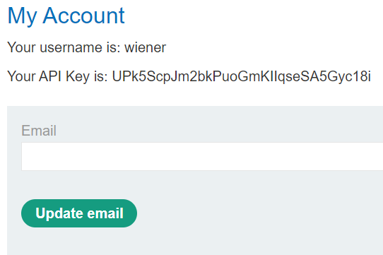
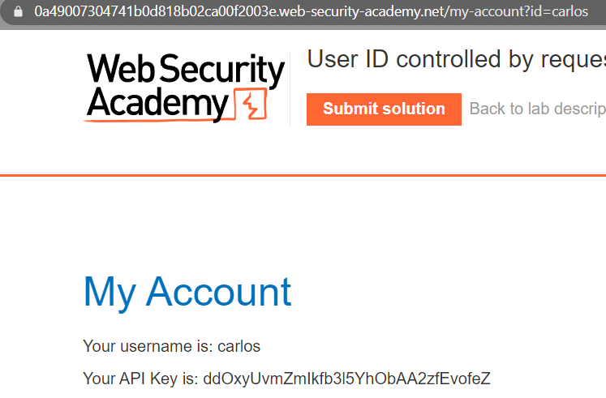
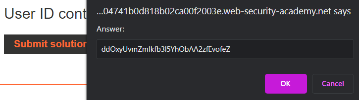

### User ID controlled by request parameter : APPRENTICE

---

> My credentials `wiener:peter`.

> Logging in as wiener.


> We see our own API key.



> Notice in the URL a parameter `id=wiener`.


> Changing it to `id=carlos` and refreshing the page.



> The API key.
```
Your API Key is: ddOxyUvmZmIkfb3l5YhObAA2zfEvofeZ
```

> Submitting it in the submit solution.



> Pressing OK completes the lab.

---
