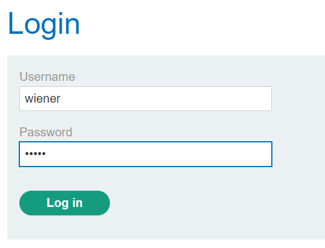

### User ID controlled by request parameter, with unpredictable user IDs : APPRENTICE

---

> Given credentials `wiener:peter`.


> Logging in as wiener.



> We see our own API key and can see the `id` parameter of the user.

![][lab8-wiener.png]

> We need to find somewhere the `id` for the user carlos.
> Going to the home page and checking out the first post.

![][lab8-post.png]

> Viewing this post.

![][lab8-carlos.png]

 > We see the the user carlos as a link.
 > Clicking on it redirects to another page.
 
![][lab8-carlosid.png]

> We see that the `userId` parameter for carlos has a value similar in structure to the one for wiener.
> Copying it and heading to the my-account page to take his API key.
```
490aed86-0a8e-4293-9ab7-74b6939836ba
```

![][lab8-car.png]

> We see his API key.
```
6cpgarLFQiEm4nzvY85pJgmkMxACUTS9
```

> Pasting it in the submit solution box completes the lab.

![][lab8-submit.png]

---
