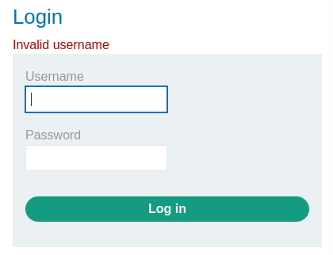
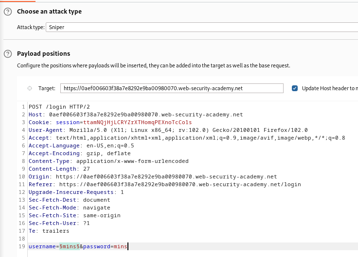
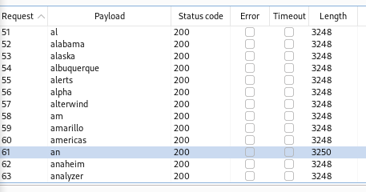
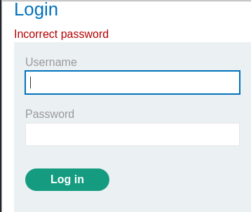
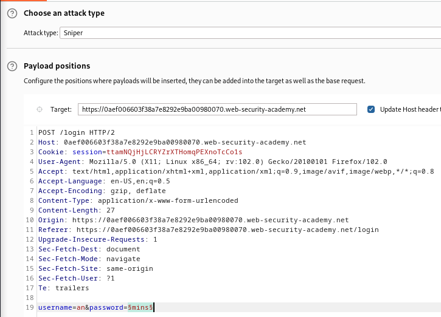
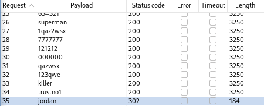
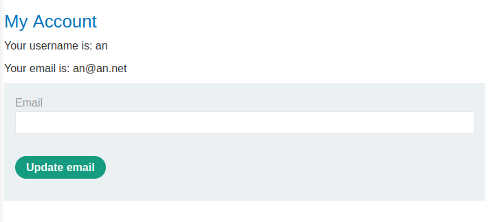

### Username enumeration via different responses : APPRENTICE

---

> Head to the login page in the My Account page.

> Try a wrong username and password and capture the sent POST request via BURPSUITE PROXY and send it to REPEATER.

> The response looks like this for wrong usernames and passwords:

> This means that the website checks first for usernames, and once they are correct, checks for the password.
> We can use the given username [list](https://portswigger.net/web-security/authentication/auth-lab-usernames) in BURPSUITE INTRUDER to test all candidate usernames. 
> Once we get a different response, we can move on to the passwords.

> Take the request captured to INTRUDER and place the placeholders in the username parameter, and choose a sniper attack.

> Go to the payloads, choose simple list, and paste the usernames found in the list.

> Start the attack and observe the different responses. This can be examined through different response sizes. 

> See that the username `an` has a different response size. 
> Observing the response, see that it is different, claiming wrong password.

> Now we can start testing the passwords with the the correct username.
> Take the passwords from this [list](https://portswigger.net/web-security/authentication/auth-lab-passwords)

> Go to INTRUDER with the same request, and change the username to `an` and put the placeholders on the password parameter.

> Set the payload as a simple list and paste the passwords from the list.

> Start the attack and observe the different response sizes and status codes.

> This shows that a completely different page is opened, possibly the page after signing in.
> Trying the password as `jordan`, the login works.

---
