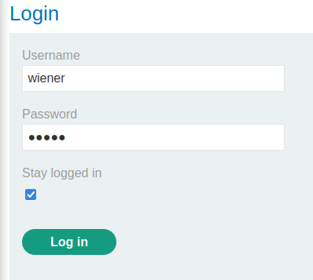
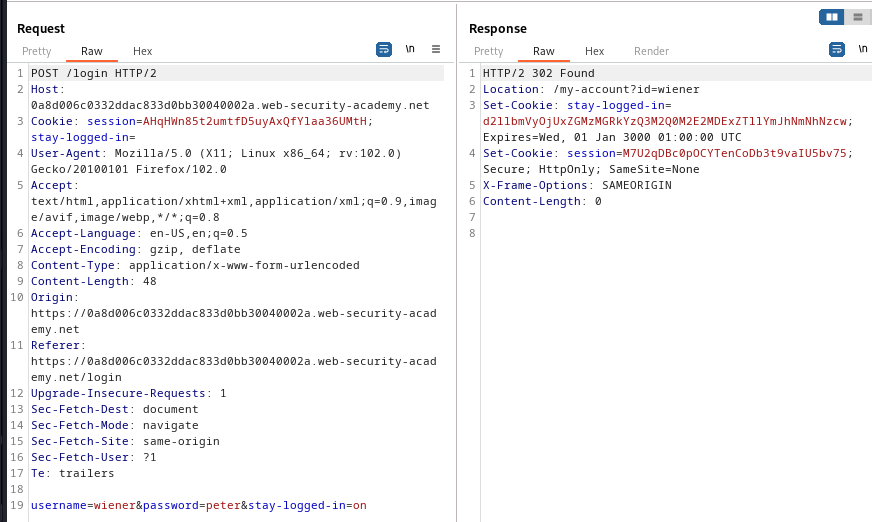

### Brute-forcing a stay-logged-in cookie : PRACTITIONER

---

My credentials `wiener:peter` and victim username `carlos` and victim candidate passwords [list](https://portswigger.net/web-security/authentication/auth-lab-passwords).
- Make sure to enable the proxy for the browser to observe all requests and responses in the HTTP History tab in BURPSUITE PROXY.

Head to the login page and login as `wiener`, and check the stay logged in box.



Observe the `POST` request and response after logging in to see that there is a cookie related to the stay logged in feature.



And then there is a `GET` request with the path `/my-account` containing that same cookie to load the correct user.


Taking the persistent cookie.
```
stay-logged-in=d2llbmVyOjUxZGMzMGRkYzQ3M2Q0M2E2MDExZTllYmJhNmNhNzcw;
```

Decoding it using the Base64 command line tool.
``` bash
echo "d2llbmVyOjUxZGMzMGRkYzQ3M2Q0M2E2MDExZTllYmJhNmNhNzcw" > cookie.txt | base64 cookie.txt -d
```
- Writing the cookie first into a file `cookie.txt`, then using the pipe operator to take the contents of the file and decode it.

This outputs the following:
```
wiener:51dc30ddc473d43a6011e9ebba6ca770
```
- This means the cookies content consists of the username, `:`, and something encoded.

Checking its length: 
```bash
cookie="51dc30ddc473d43a6011e9ebba6ca770" 
echo -n "$cookie" | wc -c
```
- This outputs 32, and since it consists of the hexadecimal characters, then it is $32*4=128$ bits, so its probably an `MD5` hash.

Using John the Ripper tool to unhash this string. We first need to store it in a file.
```bash
echo "wiener:51dc30ddc473d43a6011e9ebba6ca770" > hash
john --format=raw-md5 hash
```

This outputs the following:
```bash
wiener:peter
```

This means that the cookie is stored as follows:
```
base64(username:MD5(password))
```

> We can brute force using the candidate list of passwords the cookie for the carlos user by following these encoding steps:

1. MD5 hash the password.
2. Base64 encode the username and password separated by `:`.

Sending the final `GET` request to Intruder for a sniper attack with the payload at the cookie.


We need to add the list of passwords as a list and paste them into the payload.


Then to complete our processing, we go to the payload processing tab. We work on our payload from inside out.

1. `MD5` hash the password.


2. Add the `carlos:` prefix.


3. Base64 encode the whole payload.


This creates the cookie.
- Finally, we go to the settings tab and add a grep match rule to identify the `Update Email` text.
- If it matches, then we have successfully logged in.


Starting the attack, check for the response with the grep match rule.


The fifth password was able to correctly create the cookie for the account with username `carlos`, and has logged us in.
- Showing the response in browser and clicking on my-account finished the lab.

---
