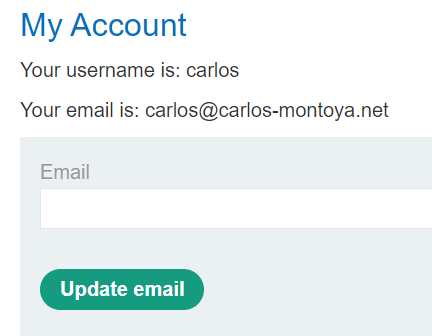

### Password brute-force via password change : PRACTITIONER

---

> My credentials `wiener:peter`.
> Victim username `carlos`.
> Victim candidate [passwords](https://portswigger.net/web-security/authentication/auth-lab-passwords).

> Login as `wiener`.

> Then study the behaviour of the change password feature.

![[Pasted image 20230702234116.png]]

> First, try entering the correct current password, and 2 matching new passwords, let it be `mins`.

![[Pasted image 20230702234246.png]]

> Second, try entering the correct current password, but 2 different new passwords.

![[Pasted image 20230702234330.png]]

> So if we enter a correct current password, but 2 different new ones, we get sent a notification that the new passwords do not match.
> We need to check if there is a similar response if the current password is incorrect.

> Try entering a wrong current password, but the same new passwords.

> We are directed back to the login page, and it seems we are blocked for a minute.

![[Pasted image 20230702234531.png]]

> Lets try a wrong current password, but different new passwords.
![[Pasted image 20230702234638.png]]

> We are told that the current password is incorrect.

> We can combine this knowledge to produce a pattern.
> If we enter a correct current password and different new passwords, we are sent a message `New passwords do not match`.
> But if we enter a wrong current password and different new passwords, we are sent a message `Current password is incorrect`.

> Therefore, we can brute force the password with the `carlos` account and look for the first message while supplying different new passwords.
> To do that, get the `POST` request that we use to change passwords.

![[Pasted image 20230702234906.png]]

> Change it so that the username is `carlos`, and then send it to BURPSUITE INTRUDER for a sniper attack.

![[Pasted image 20230702235002.png]]

> Add the payload in the current password parameter, and ensure that the 2 new passwords are different.

> Add the simple list payload with the pasted passwords from the link.

![[Pasted image 20230702235116.png]]

> Then add a grep match rule to identify the response with the wanted message `New passwords do not match`.

![[Pasted image 20230702235213.png]]

> Start the attack and look for the response with that message.

![[Pasted image 20230702235328.png]]

> Also notice it is a different length, than all the others.
> Our password for the user `carlos` is `asdfgh`.

> Trying to login with these credentials solves the lab.

---
