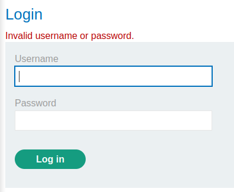

### Username enumeration via subtly different responses : PRACTITIONER

---

> Head to the login page in the My Account page.

> Try a wrong username and password and capture the sent POST request via BURPSUITE PROXY and send it to REPEATER.

> The response looks like this for wrong usernames and passwords:

> Using the same procedure as [[Portswigger/Authentication/Lab 1|Lab 1]], brute force the usernames first and see if there is any difference among any of the usernames by sending the login POST request to BURPSUITE INTRUDER.
> Set the attack as sniper, and put the placeholders in the username parameter.

> Set the payload as a simple list, and paste the [Usernames](https://portswigger.net/web-security/authentication/auth-lab-usernames).

> To see the small difference, go to the settings and go the `grep - extract` area.
> Fetch a response and highlight the text `Invalid username or password.` and the remaining settings are set.

> This will mark this text in all the brute force attempts, and start the attack.

> Once the attack starts, notice that the size is different for each response, so we cannot use it to test our attempts.
> The column we added with the extracted text can be used. Filter by it, and see that there is a response with a space instead of a fullstop.

> This different response can be used to confidently say that this username is correct, `arizona`.
> Now we can test that username with the [passwords](https://portswigger.net/web-security/authentication/auth-lab-passwords) using the same techqniue as the usernames via intruder to find the correct password.

> Set the placeholders on the password parameter in the POST request, and set the username to the one we found `arizona`.

> And set the payload as a simple list with the copied passwords.

> Start the attack, and check the page with the 302 response meaning we logged in and in a different page.

> Our password is `joshua`.
> Use that to login and complete the lab.

---
