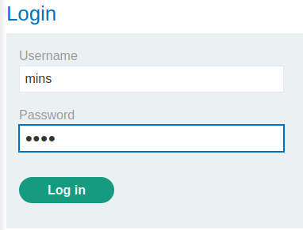
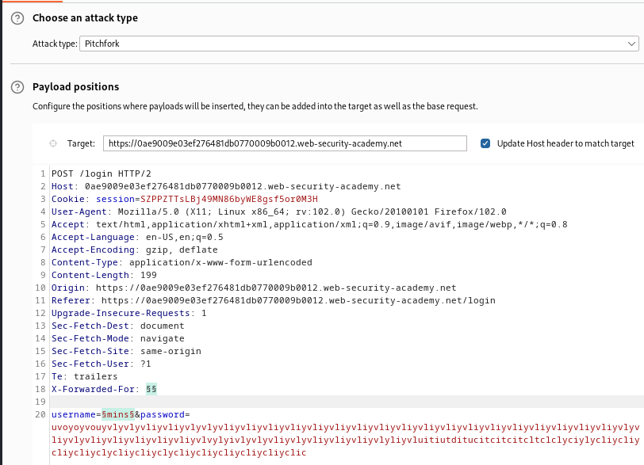

### Username enumeration via response timing : PRACTITIONER

---

> My credentials: `wiener:peter`.

> Head to the login page in the My Account page.

> Try a wrong username and password and capture the sent POST request via BURPSUITE PROXY and send it to REPEATER.

> The response looks like this for wrong usernames and passwords:

> Tried the same technqique as [[Portswigger/Authentication/Lab 1|Lab 1]] to enumerate the usernames, but i got blocked.

> This means that they blocked my IP address. So i tried using the `X-Forwarded-For` header in the request to change my IP address to a random IP and submit the same request.

> Sending that request, i got the normal response of wrong username and password.

> So this means we need to change our IP address constantly to not get blocked. Send this request to BURPSUITE INTRUDER and choose a pitchfork attack.
> Set the placeholders in the username and the `X-Forwarded-For`.
> Furthermore, i made the password long so the response time is long if the correct username is found.

> Set the first payload for the IP address to numbers from 1 to 100, meaning we will use 100 different IP addresses.

> And set the second payload for the username to be the copied [list](https://portswigger.net/web-security/authentication/auth-lab-usernames).

> Start the attack, and bring out the response recieved column.

> See the correct username `wiener`'s long response time, we know that it checks the username first. If the username is found, it then checks the password. Since our password is really long, server responds in a long time. 
> For username `analyzer`, it takes roughly the same amount of time as `wiener`, meaning it is the correct username.

> Using the same technique to change the IP address and the password from this [list](https://portswigger.net/web-security/authentication/auth-lab-passwords), we can find the correct creds.

1. We change the number list for the IP address so as not to take the same IP's as last time.
2. Make the username `analyzer`.
3. Add the placeholders for the password parameter.
4. Change the payload to the copied list.

> Start the attack and look for the response with status code 302 meaning that the login was successful.

> Use the username `analyzer` and password `klaster` to login and complete the lab.

---
