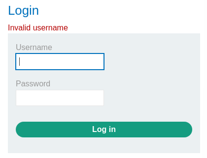

### Broken brute-force protection, IP block : PRACTITIONER

---

> My credentials: `wiener:peter`.

> Head to the login page in the My Account page.


> Try a wrong username and password and capture the sent POST request via BURPSUITE PROXY and send it to REPEATER.


> The response looks like this for wrong creds:



> We have a given username `carlos` to log into.
> Trying the normal attack as [[Portswigger/Authentication/Lab 1|Lab 1]] to enumerate the password given the username doesn't work because after 3 attempts, i am blocked from the page.


>Trying the `X-Forwarded-For` header to change my IP address doesn't work.
>However, logging in with the correct credentials resets the counter, which means we can put the correct credentials inside the brute force attack to keep resetting the counter until the correct password is found.

> To do that, use the given [passwords](https://portswigger.net/web-security/authentication/auth-lab-passwords) and the `peter` password, and the usernames `carlos` and `wiener` in the BURPSUITE INTRUDER pitchfork attack.

> First, setting the placeholders in the username and password.


> Setting the payloads for the username will simply be 2 `carlos` then `wiener` repeated.
> This is to match the passwords as well which will be 2 from the list, and then `peter`.

1. Username payload


2. Password payload
> Using this python script, i pasted the passwords from the online list and inserted `peter`.

``` python
file1 = open('passwords.txt', 'r')
Lines = file1.readlines()

passes = [] 

for line in Lines:
    passes.append(line.strip())
    passes.append('peter')

file1.close()

file2 = open('passwords.txt', 'w')
for line in passes:
    file2.write(line + '\n')
file2.close()

```


3. Go to resource pool and make the max concurrent requests equal to 1 so as to make sure the order is preserved.


> Start the attack and find the 302 response with the username carlos.


> Therefore, the password is `baseball`.
> Login to complete the lab.

---
