### Username enumeration via account lock : PRACTITIONER

---

> Head to the login page in the My Account page.

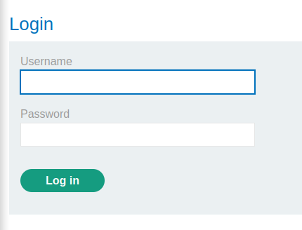

> Try a wrong username and password and capture the sent POST request via BURPSUITE PROXY and send it to REPEATER.

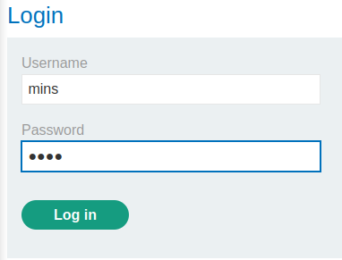

> The response looks like this for wrong usernames and passwords:

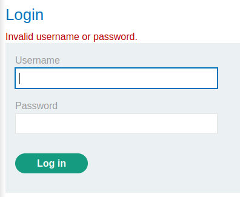

> We need to find the correct username that when logged to multiple times with an incorrect password, locks.
> To do that, we use the BURPSUITE intruder clusterbomb attack, and run each username 5 times with a wrong password.

1. Place the placeholders in the username and password parameters.

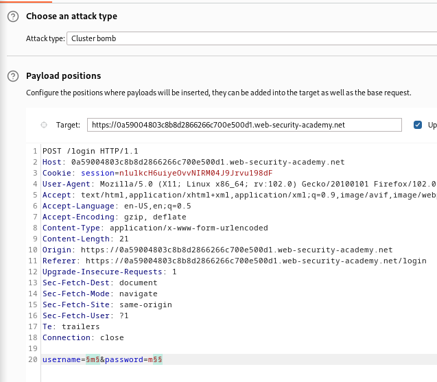

2. Set the username payload to be the copied [list](https://portswigger.net/web-security/authentication/auth-lab-usernames).

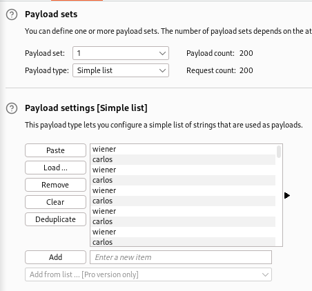

3. Set the passwords to null payloads, effectively just repeating the same username x number of times. Set the Generate payload setting to 5, so as to repeat each username 5 times.

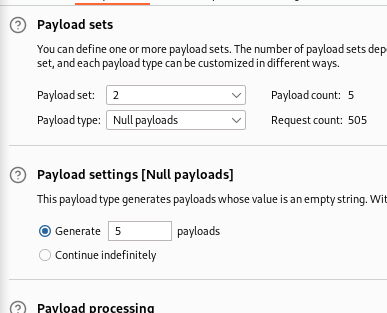

> Start the attack, and notice for which username does the response length change after multiple incorrect login attempts.

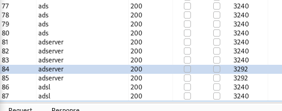

> Notice that the size is different, opening the response, we see a different response than the normal.

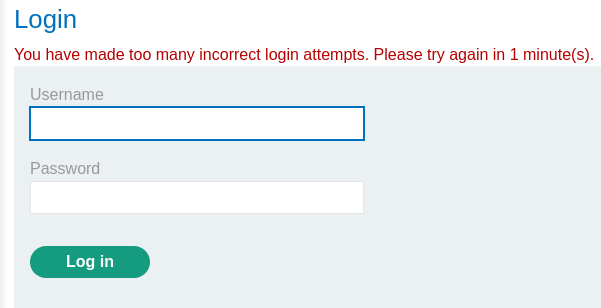

> This means that the username `adserver` we found is the correct username that exists on the website.
> Now using a sniper attack to determine the password using this [list](https://portswigger.net/web-security/authentication/auth-lab-passwords).
> Set the username as `adserver` and put the placeholders on the password.

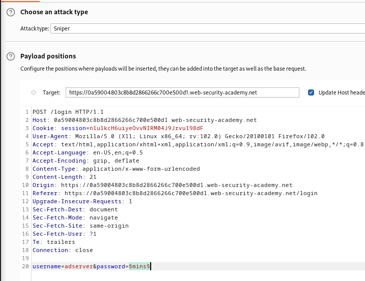

> Setting the payload as a simple list and pasting the copied passwords from the online list.

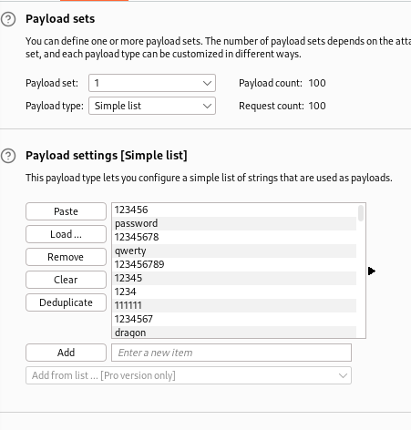

> Start the attack and look for the response with the 302 status code signifying we have logged in and moved to a different page.

> The attack finished, and there was no redirect. However, there were 2 mainly seen sizes, `3292` signifying that i need to wait, and `3240` signifying wrong username or password.
> There was only one password with a response of a different size, `3162` that had no error messsages.

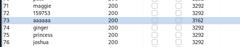

> Trying this password `aaaaaa` with the username `adserver` to log in completes the lab.
> Must wait a minute because the requests locked the account.

---

