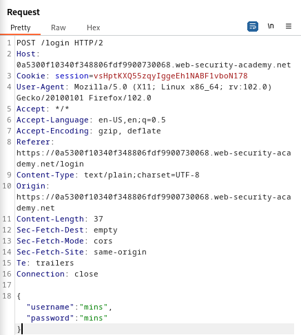
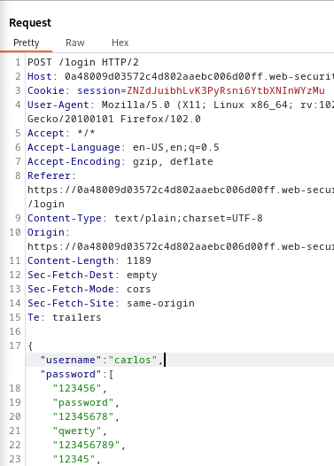
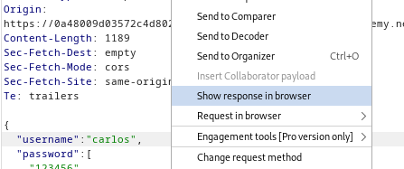
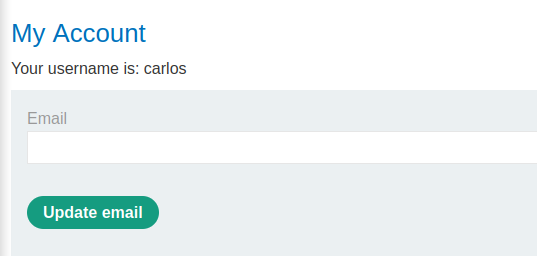

### Broken brute-force protection, multiple credentials per request : EXPERT

---

Given username `carlos`.
- Head to the login page in the My Account page.


Try a wrong username and password and capture the sent POST request via BURPSUITE PROXY and send it to REPEATER.


The response looks like this for wrong usernames and passwords:


Played with the request in BURPSUITE repeated and got blocked after 3 incorrect guesses.


> Observe the request further and see that the username and password aren't passed by parameters, but instead they are passed in a JSON object.



So we can simply paste all the passwords from this [list](https://portswigger.net/web-security/authentication/auth-lab-passwords) and put them in the request.
- To do that, we need to add quotes after all the strings, as well as add a comma after each password to match the JSON format.
- Do that using this python script:

```python
file1 = open('password-list', 'r')
Lines = file1.readlines()

passes = [] 

for line in Lines:
    passes.append(line.strip())

file1.close()

file2 = open('password-list', 'w')
for line in passes:
    file2.write('"' + line + '"' + ',' + '\n')
file2.close()
```

Then paste the list between `[]` in the password key, and make the username `carlos`.



Send the request with all the passwords, and see that the response comes with a 302 response.
- To view that, right click on the request and view it in browser.



Copy the URL and paste it in the browser, turn on the BURPSUITE proxy for it work, and see that I'm logged in as `carlos`.



---
