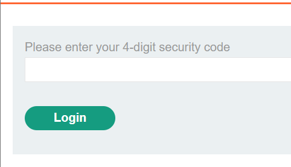
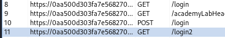
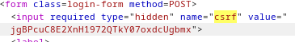
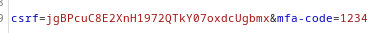
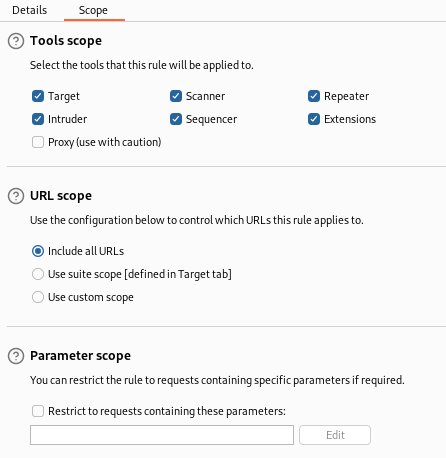
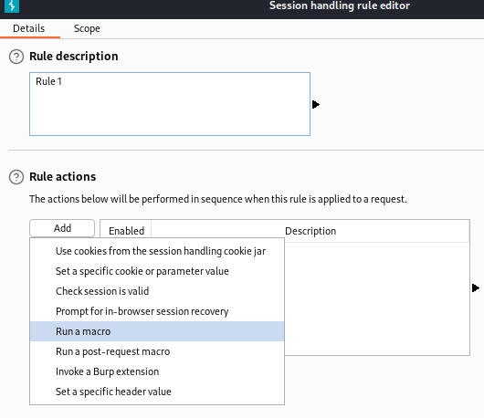
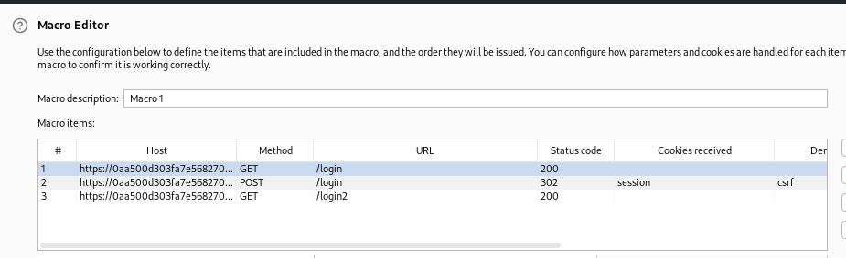
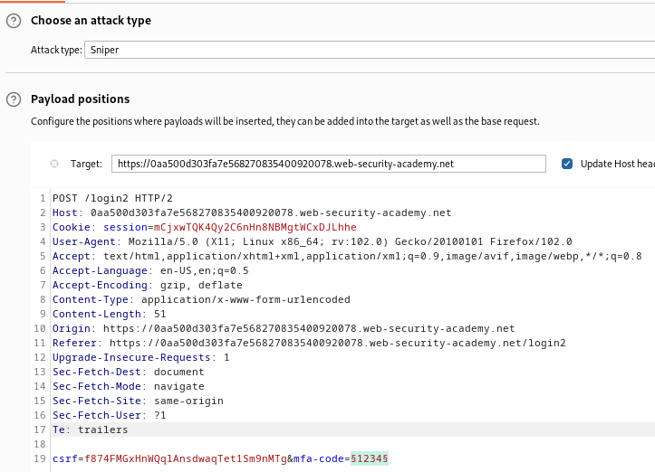
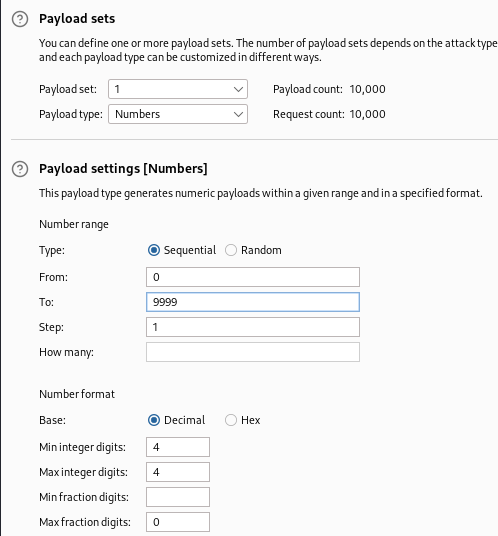

### 2FA bypass using a brute-force attack : EXPERT

---

> Victim credentials `carlos:montoya`.

> Head to the login page in the My Account page.

> Login as carlos and see that a verification page appears.

> Entering it wrong 2 times logs us out. 
> Using BURPSUITE PROXY http history, see that there is a very similar sequence of requests as [[Portswigger/Authentication/Lab 8|Lab 8]].
> There is first a `GET` request to the login page, then a `POST` request with the credentials, followed by a `GET` request with the verification page.

> Once we submit a code in the verification page, a `POST` request is sent. Use that `POST` request and send it to BURPSUITE intruder sniper attack.
> Put the payload in the `mfa-code` parameter and brute force the verification code.
> See that all responses have code 400 with a message `invalid csrf token`.

> Studying the requests, we see that a new `csrf` token is generated every time we are logged out (after 2 incorrect attempts).
> In the first `GET` request, and the last `GET` request, a `csrf` token is randomly generated. And that same value is checked for in the `POST` request.

1. Inside the `GET`.

2. Inside the `POST`.

> Therefore, we need to manually create `csrf` tokens before each intruder attack, so that we can brute force the code.
> However, this means the code will change every time we login and logout, so brute forcing it might take some time.

> To perform automatic loggin in/ logging out, we need a macro in BurpSuite.

1. Go to settings and then Sessions.

2. Click on Add to create a new rule, and then go to Scope and choose Include all URLs.

3. Then go to Details and press on Add and choose Run a Macro.

4. Add the 3 requests responsible for creating a csrf token.

5. Then press ok on all tabs to complete creating this macro rule.

> This rule now should work before every intruder request.
> Send the last `POST` request responsible for sending the `mfa-code` to INTRUDER, and choose a sniper attack and set the placeholders at the `mfa-code` value.

> Go to payloads and choose a number list from 0 to 9999 and set the step 1, and set the min and max digits to 4, and fractions digits to 0 to obtain 4 digit numbers from 0 to 9999

> Furthermore, make sure that are a maximum of 1 concurrent requests through the resource pool tab to ensure proper request generation and csrf token creation.

> Start the attack and wait for the 302 response.

> To login using that specific payload, we right click on that response and view it in browser.

> Open BURPSUITE Proxy intercept, and allow proxy in the browser, then paste this url and follow redirections through the intercept tab.

> Complete the lab by pressing on my account.

---
