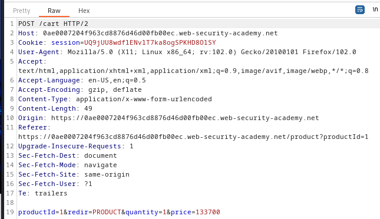
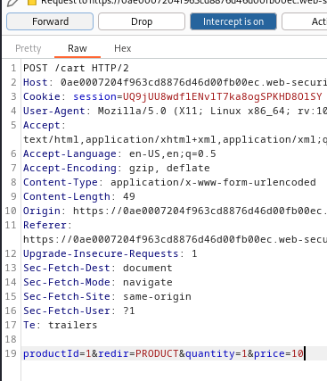
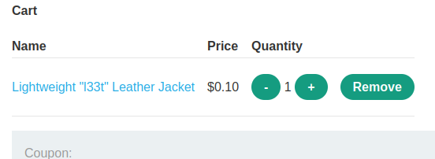

### Excessive trust in client-side controls : APPRENTICE

---

Login via the given credentials `wiener:peter`.

Then head to the required item `Lightweight "l33t" leather jacket`.

> With BURPSUITE PROXY intercept on, capture the request that is sent when pressing on `add to cart`.

> The `POST` request captured containing the details of the product.

> See the `price` body parameter can be changed. 
> Changing the price to something trivial like 10 and then forwarding the requests.

> Visiting the cart page now shows that the item was added with the modified price.

> Placing the order completes the lab.

---
