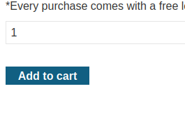

### Insufficient workflow validation

---

> Given credentials : `wiener:peter`.
> Need to by the `Lightweight l33t leather jacket`.

> Login via the given credentials `wiener:peter`.

> We have 100$ in store credit, so lets try buying an item we can afford to observe the payment and checkout processes.

> Viewing this items details and then adding to cart.

> Going to cart and placing the order.

> With BURPSUITE INTERCEPT HTTP history, observe the sequence of requests sent after placing the order.

> The `GET` request is the request that confirms the order only for the item we added.
> If we add another item in the basket, and then resend that exact same `GET` request again, maybe we can break the logic.

> Adding the required `Lightweight l33t leather jacket`.

> Then resending the same `GET` request as above and observing the response.

> We see that we deducted only 64 dollars from store credit, the price of the old item, but the item we bough is for 1337$.

> We broke the sequence of requests by adding an item in the basket then resending the confirmation for a different item.

> The lab is complete.

---
