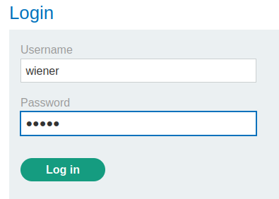
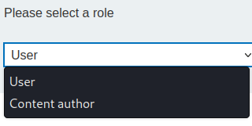

### Authentication bypass via flawed state machine : PRACTITIONER

---

> Given credentials `wiener:peter`.
> Goal is to access the admin interface and delete user with username `carlos`.

> Login via given creds.

> We are then asked to select a role. We are looking for admin, or something of the sort.

> The only available ones are:

> Choosing either one, but monitoring the request in BURPSUITE PROXY HTTP history.

> Changin the role to `admin` and resending the request.

> We can't do that, we must first login. Hence, there is a sequence that must be followed.
> Trying to alter the sequence of requests might work.

> With BURPSUITE PROXY on, login as `wiener`.
> Forwarding the `POST` request with the login creds.

> But then dropping the `GET` request right after responsible for selecting the role.

> We get an error. Opening the lab again, we are redirected to the home page of the admin user.

> Opening the admin panel to delete the carlos user completes the lab.

> Accessing it, we can delete the `carlos` user to complete the lab.

---