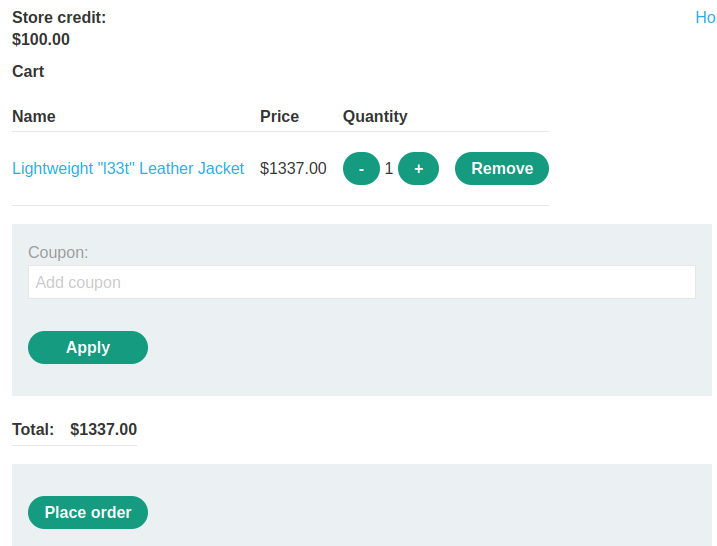
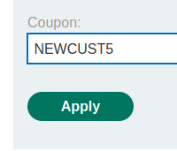
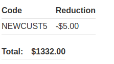
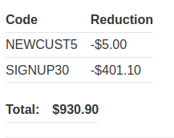
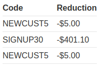
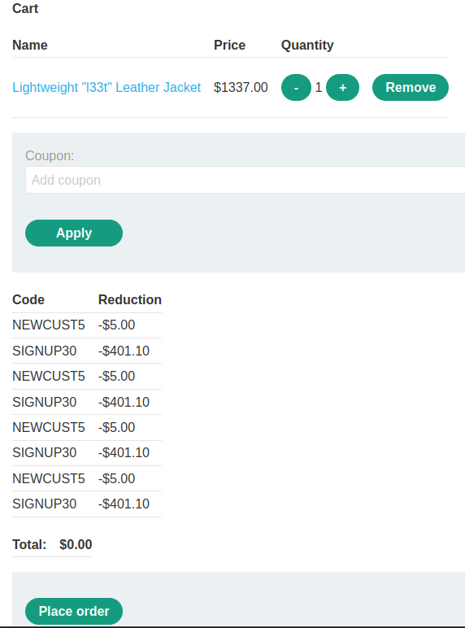

### Flawed enforcement of business rules : APPRENTICE

---

> Need to buy the item `Lightweight l33t leather jacket`.
> My credentials `wiener:peter`.

> Login via the given credentials `wiener:peter`.

> Then head to the required item `Lightweight "l33t" leather jacket`.

> And add it to cart.

> See that there is a coupon code present on the home page.

> Furthermore, signing in to the newsletter at the bottom of the home page.

> Gives another coupon code.

> We now have 2 coupons:

1. `NEWCUST5`.
2. `SIGNUP30`.

> Heading to the cart page.

> Applying the first coupon code.

> Results in:

> Trying to apply the same coupon again.

> Results in an error.

> Trying the second coupon.

> Results in:

> If we try `signup30` again we get the same error of repetittion.
> Trying to enter the first coupon, `newcuts5`, again, to see if the repetition check can be bypassed.

> Works, and the coupon is placed again.

> Trying to add `signup30` again works.
> Therefore, we keep on alternating the coupon codes until the price is within our limit of 100$.

> Now we can place the order to complete the lab.

---
