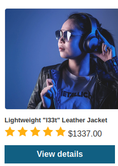
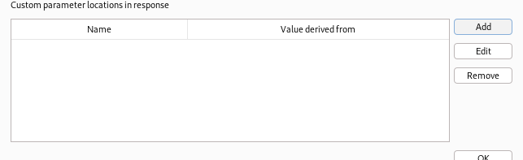
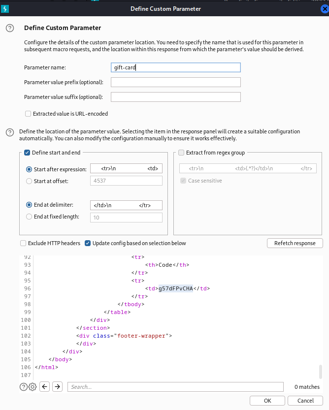

### Infinite money logic flaw : PRACTITIONER

---

> My credentials `wiener:peter`.
> Need to buy the item `Lightweight l33t leather jacket`.

> Login via the given credentials `wiener:peter`.

> Signing in to the newsletter at the bottom of the home page.

> Gives coupon code.

> Moreover, there is a `gift card` item in the home page.

> Viewing its details and adding to cart.

> Heading to the cart page and placing the coupon code `SIGNUP30`.

> Results in:

> Placing the order.

> Our store credit is now 93.
> And we have a gift card code `g57dFPvCHA`.

> We can apply this gift card in the my account page.

> Redeeming the code, we see our store credit is now 103 in total.

> Therefore, we can keep repeating this process to increase our store credit to be able to purchase the item `Lightweight l33t leather jacket`.

> Taking note of the HTTP requests that are important using BURPSUITE PROXY HTTP history.

1. `POST /cart` : Adding the gift card to cart.
2. `POST /cart/coupon` : Adding the coupon code in checkout.
3. `POST /cart/checkout`: Placing the order.
4. `GET /cart/order-confirmation` : Obtaining the gift-card code.
5. `POST /gift-card` : Redeeming the gift card code. 

> Since we need to automate these 5 requests, we are going to use a macro.
> This macro will work alongside BURPSUITE INTRUDER in each attack to perform these requests.

> Creating the macro.

1. Go to settings and then Sessions.

2. Click on Add to create a new rule, and then go to Scope and choose Include all URLs.

3. Then go to Details and press on Add and choose Run a Macro.

4. Press Add again, and then add the requests in order to create the macro.

5. To use the correct gift card code each time, we go to the `GET /cart/order-confirmation?` request and press on configure items.

6. Then we press on add a parameter at the bottom to include our gift card code.

7. We then name it `gift-card` for simplicity, and to get its value, select it in the response at the bottom.

8. To take this custom parameter from this request and carry it to the next one to redeem it, we need to configure the `POST /gift-card` request.

9. Specifying that the `gift-card` parameter should be from the previous response.

> To test that the macro works, press on test macro and check that the gift-card in the last response is the same as that in the previous response.
> Also make sure that all requests are either 200 or 302 resp codes.

> Now that we created the macro, we use BURPSUITE ITNRUDER to generate indefinite requests, and with each request the macro is run, until we have enough store credit to buy the required item.
> Sending a dummy request to intruder and adding empty payload for a sniper attack.

> Choosing the payloads as null payloads and making it indefinite.

> We also need to make sure that these requests are carried out in order, so we make the max concurrent requests equal to 1.

> Finally, we run the attack and keep refreshing the my-account page to observe the store credit.
> Once i have enough credit, go to the required item and add it to cart.

> Placing order completes the lab.

---
