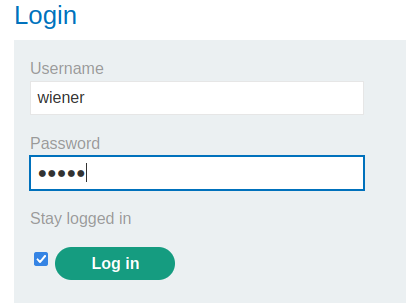
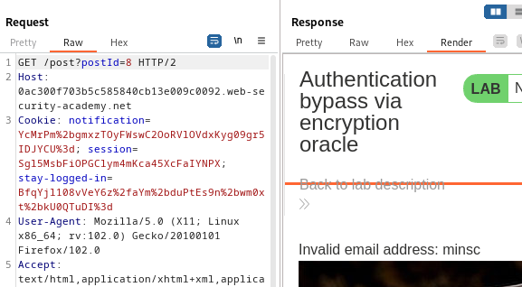
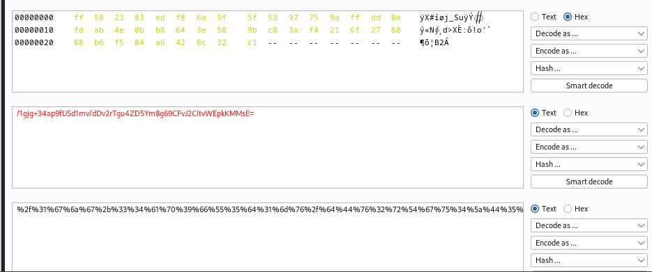

### Authentication bypass via encryption oracle : PRACTITIONER

---

> Given credentials `wiener:peter`.
> Need to access admin panel and delete the user `carlos`.

> Loggin in with the stay logged in option.



> Observing the `POST` request to login and its response, we see that the `stay-logged-in` cookie is encrypted.


> Going to post a comment with the BURPSUITE PROXY HTTP history open.


> We get 2 requests, as well as see a message regarding the invalid email address.


> The first `POST` request: 


> There is a cookie called `notification`.

> The second request to simply get the page after posting the comment.



> The same cookie notification with the same value, and we see the text `invalid email address:minsc`.
> Maybe the encoded notification cookie contains the value `minsc`.
> The value `minsc` was given in the email parameter.

> Changing the email parameter to something else to test this theory.


> We see that the notification cookie value changes.
> Observing the `GET` request after.


> We see that the value of notification cookie is the same, and the text is also reflected.
> Hence, this means that the email address we enter is encrypted into the notification cookie, and then displayed.

> We can use this to change to admin user.
> Copying the `stay-logged-in` cookie and placing it into the `notification` cookie of the `GET` request displays the decoded version of the cookie.

```
stay-logged-in : BfqYjl108vVeY6z%2faYm%2bduPtEs9n%2bwm0xt%2bkU0QTuDI%3d
```


> We see that the cookie is simply the username followed by `: ` and a timestamp.
```
wiener:1688803306564
```

> We want the `stay-logged-in` cookie to look like this:
```
administrator:1688803306564
```

> To do that, we place this exact text into the email parameter.


> And then observe the `GET` request response.


> We need to remove this `invalid email address: ` portion from the cookie.
> To do that, we take the cookie to BURPSUITE DECODER.


> We first URL decode it, then base64 decode it.
> We then remove the first 23 characters corresponding to the text `invalid email address: `.


> We then base64 encode it, then URL encode it.



> We copy the final cookie, and place it into the `notification` cookie of the `GET` request.


> We removed 23 characters, which isn't a multiple of 16.
> Adding 9 dummy characters in the beginning before URL decoding and Base64 encoding and then removing 32 should work.

> So we add into the email of the `POST` request:
```
123456789administrator:1688803306564
```

> Then send the request.


> Now, we take the `notification` cookie to the decoder, and do the same as above.
> Decode as URL, decode as base64, then delete 32 chars.


> Encode as base64 then encode as URL then copy that value.

```
%4e%52%44%41%2b%36%6a%61%70%64%7a%4f%31%68%52%70%78%63%72%39%7a%66%5a%45%47%6e%73%4e%33%30%70%4a%47%4e%6b%4b%57%73%45%7a%56%79%6f%3d
```

> Go to the home page of the webpage, and observe its `GET` request.


> To become admin, we need to replace the `stay-logged-in` cookie with the one we created, and remove the `session` cookie.


> Forwarding this request, we get the admin panel.


> Opening it to delete carlos completes the lab.

---
