### 2FA broken logic : PRACTITIONER

---

> My credentials `wiener:peter`.
> Victim username `carlos`.

> Studying the website and how the login/verification steps work.

> First, attempting to login on the login page with the credentials `wiener:peter`.

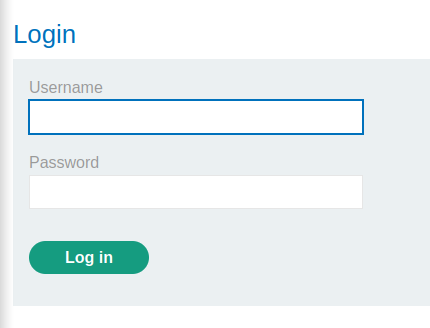

> This sends two requests. A `POST` request with the credentials, and a `GET` request with the `verify` cookie holding the username of the account being logged into.

1. POST

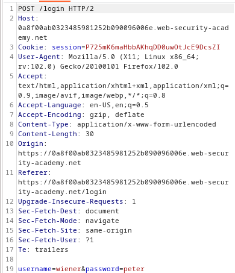

2. GET

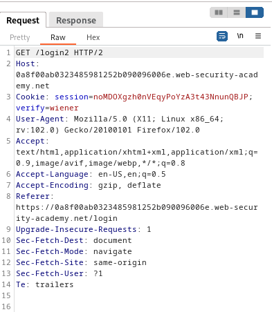

> This second `GET` request to the `login2` page is the request to fetch the verification page.

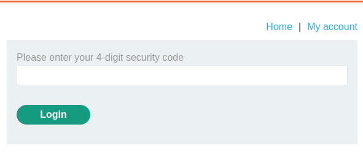

> It also sends the verification code to the email of that account.

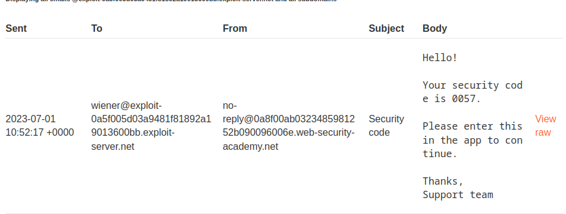


> Entering that verification code into the verification page sends 2 requests. A `POST` request with the code in the `mfa-code` parameter, and a `GET` request with the user's account if the `mfa-code` holds a correct value.

1. POST

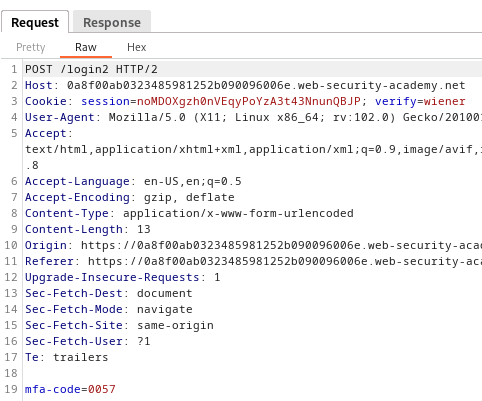

2. GET

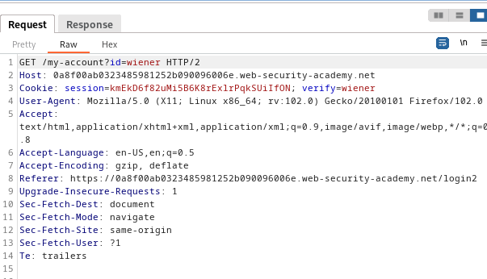

> Now that we know the sequence of GET/POST requests, we need to check if we can change some of the cookies and parameters to login as `carlos`.

> Since the second `GET` request of the login phase, the `GET /login2` request is responsible for fetching the verification page and sending the code, we can change the `verify` cookie to the username `carlos`.
> This will generate a code for the user `carlos`. 
> We can then play with the `POST` request in the verification page and brute force the code. However, we must also make the `verify` cookie in that request for `carlos`.

1. Generate an OTP for `carlos`.

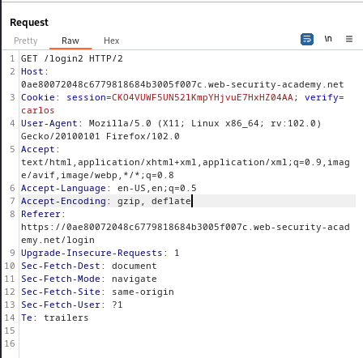

2. Enter any OTP in the verification phase and capture the `POST` request. Modify the `verify` cookie to be for `carlos`.

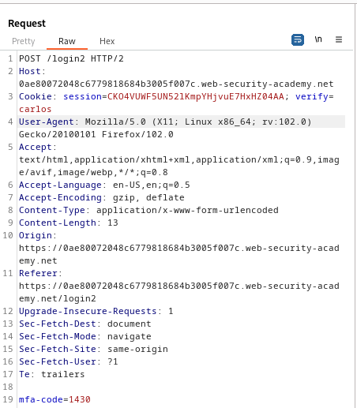

> Now we need to brute force the `mfa-code` value. This `POST` request as understood, if contains the correct OTP, will generate the `GET` request responsible for fetching the account for the desired username.

> Install the `turbo intruder` extension for a faster brute force attack from the Extensions > BApp store tab.
> Once installed, right click on the `mfa-code` parameter and then choose extensions, Turbo Intruder, and then send to Turbo Intruder.

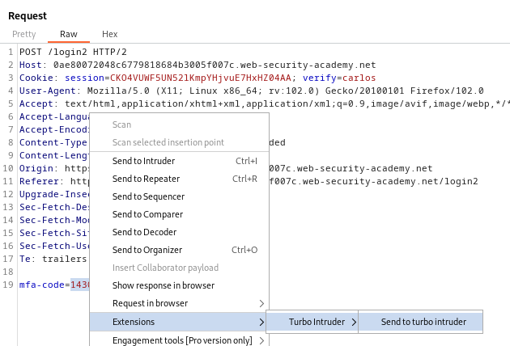

> This opens the turbo intruder interface, containing a python script and the request, and the area that will be injected replaced with a `%s`.

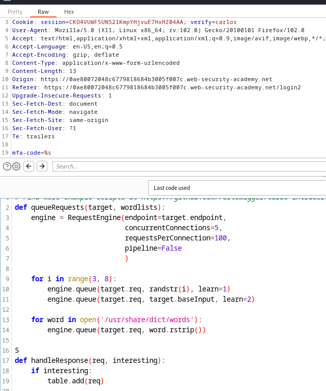

> We need to insert all possible payloads into a txt file, and then use that file for the attack.
> To do that, use the `crunch` tool to generate all 4 digit number permutations into a file called `list.txt`.
```
crunch 4 4 0123456789 -o list.txt
```

> Now in `list.txt`, numbers from `0000` to `9999` are written separated by new lines.

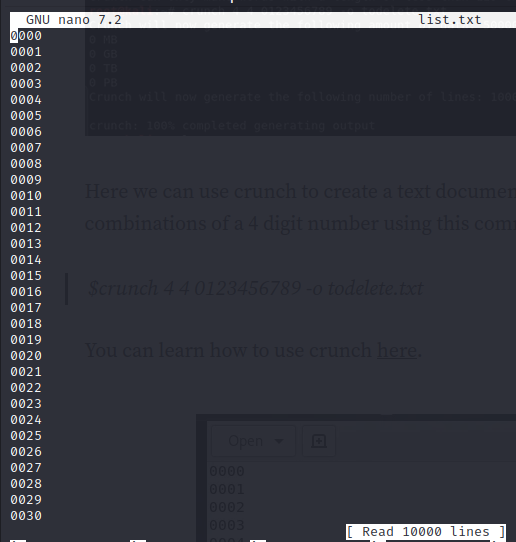

> Then modify the script to point to that list.

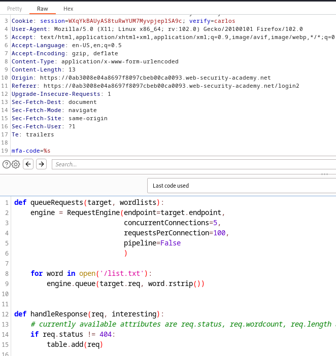

> Start the attack and find the response with a 302 status code.

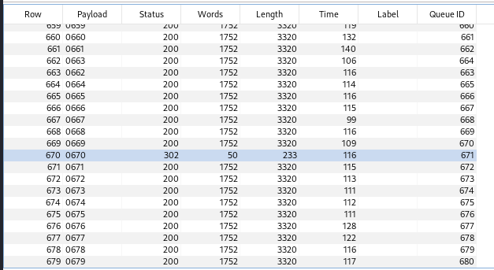

> Therefore, the OTP is `0670`.
> Right click on that response to view in browser, and copy the URL.
> Turn on burp proxy to be able to paste that URL into your browser.

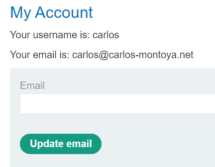

> Click on `my account` to complete the lab.

---
