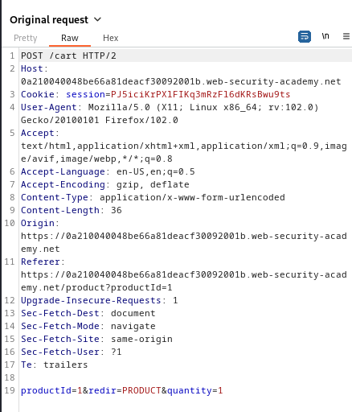

### High-level logic vulnerability : APPRENTICE

---

> Similar to [[Portswigger/Business Logic Vulnerabilities/Lab 1|Lab 1]], login via the given credentials `wiener:peter`.

> Then head to the required item `Lightweight "l33t" leather jacket`.

> With BURPSUITE PROXY intercept on, capture the request that is sent when pressing on `add to cart`.

> The `POST` request captured containing the details of the product.

> We can only play with the `quantity` body parameter.
> Placing in a very large number, or a string produces an error.

> However, placing a negative number works.

> Heading over to the `my cart` page.

> Placing my order gets an error, that the total price cannot be less than 0.

> We have `100$` in store credit, so we need the total price to be less than 100 but more than 0.
> Trying to change the quantity parameter to another number and sending the request doesn't change the cart, but it adds the number in the cart to the number in the quantity parameter.

> So if we change the `POST` request above with -5 to 6, the total cart quantity will not be 4, but will be 1.

> We now need to add another item in a negative quantity so that the price is less than 100 store credit that we have.

> Going to the home page and choosing another product.

> Capturing the `POST` request that is sent when this item is sent to cart is exactly the same as the `POST` for the jacket, but with `productId=2` parameter changed.
> Sending -30 of them to see the total price.

> The cart total is still 223$.

> Adding -6 more of the item to reach a suitable price.

> The cart price is now 0.32$, less than the 100, so we can place the order and complete the lab.

---
