### Low-level logic flaw : PRACTITIONER

---

> Similar to [[Portswigger/Business Logic Vulnerabilities/Lab 1|Lab 1]], login via the given credentials `wiener:peter`.

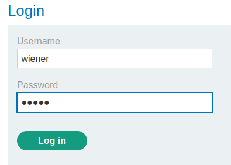

> Then head to the required item `Lightweight "l33t" leather jacket`.

> With BURPSUITE PROXY intercept on, capture the request that is sent when pressing on `add to cart`.

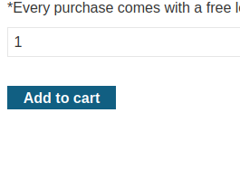

> The `POST` request captured containing the details of the product.

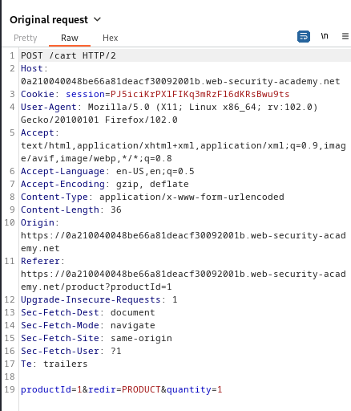

> We can only play with the `quantity` body parameter.
> Trying to enter large numbers doesn't work.

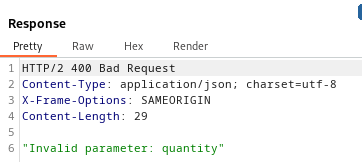

> Only 2 digit numbers work, and similar to [[Portswigger/Business Logic Vulnerabilities/Lab 3|Lab 3]], the price in the cart is added to the price of the item sent in the `POST` request.

> Since the quantity can be a max of 2 digits, we can keep adding 99 so that the total price keeps increasing, to test if there is an upper limit.
> Modifying the `POST` request to have 99 `quantity`.

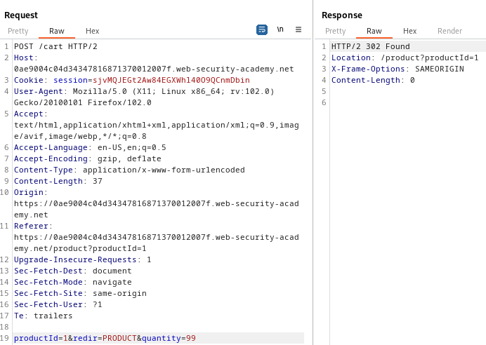

> Keep sending this request multiple times and refresh the cart page.

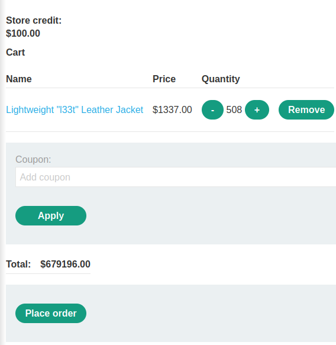

> We see the total is 679196$.
> To automate this task of reaching the limit and testing the behaviour, we use BURPSUITE INTRUDER sniper attack to add to cart indefinitely.

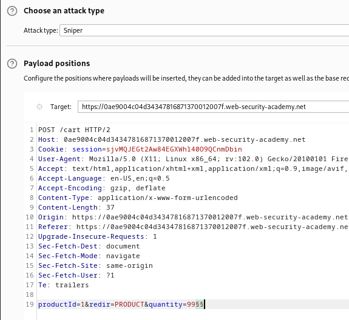

> We set an empty placeholder but add the null payloads and set it to continue indefinitely.

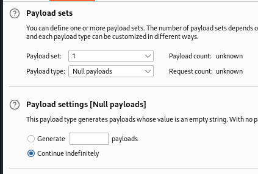

> We start the attack and monitor the total price of the cart by refreshing the page.

> I expect the limit to be the maximum value of an integer, which is `2,147,483,648`.
> After that, the behaviour of the total price might change.

> After a while, i refreshed the cart page and the cart price is in the negatives.

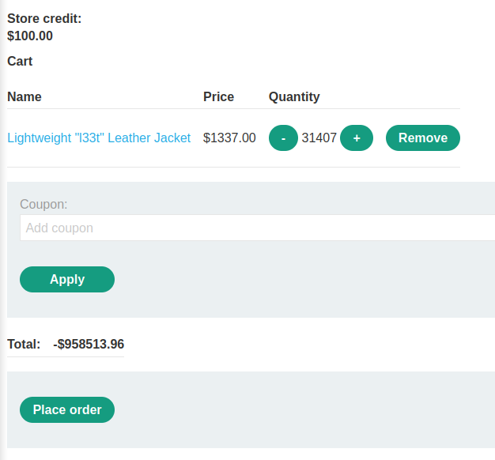

> We need to add items to increase the price to be between 0 and 100 because we cant place order with a negative total.

> Going to the home page and choosing another product.

> Capturing the `POST` request that is sent when this item is sent to cart is exactly the same as the `POST` for the jacket, but with `productId=2` parameter changed.
> Modify the `POST` request and make the `productId=2` and the `quantity=99` as well to keep increasing the price.

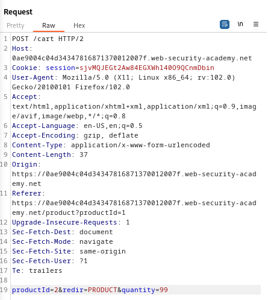

> Automate this process using intruder as the above one until the price reaches 0 or above.

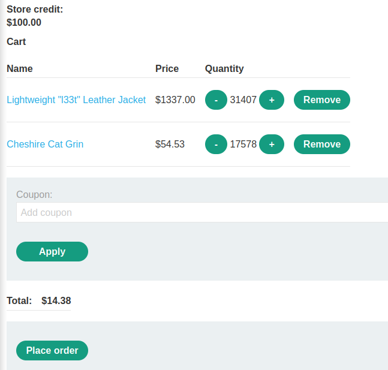

> Now the total price is within our budget, placing the order completes the lab.

---
