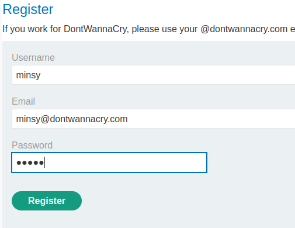
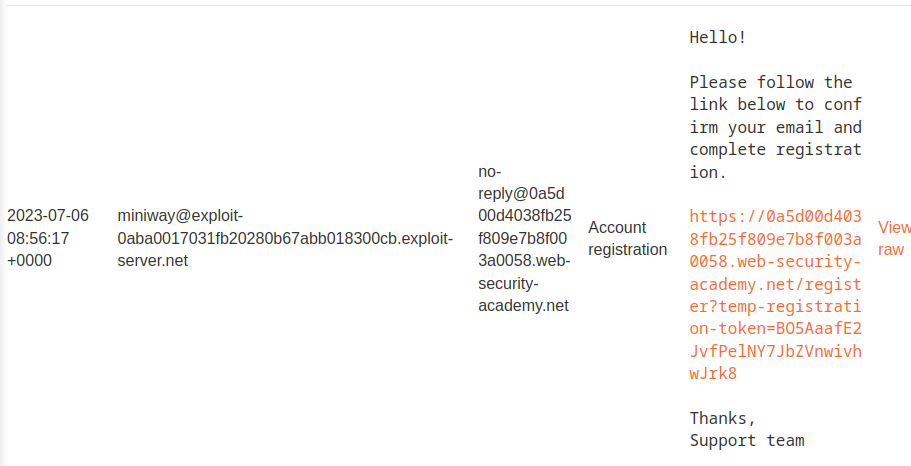
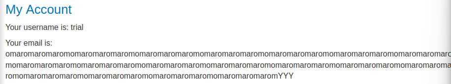
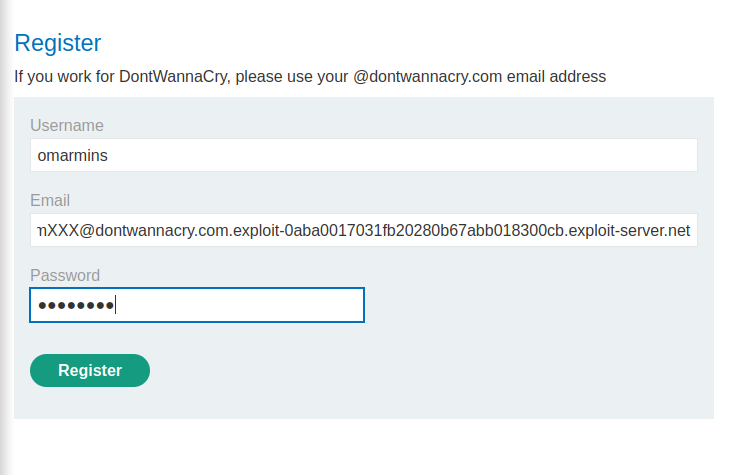
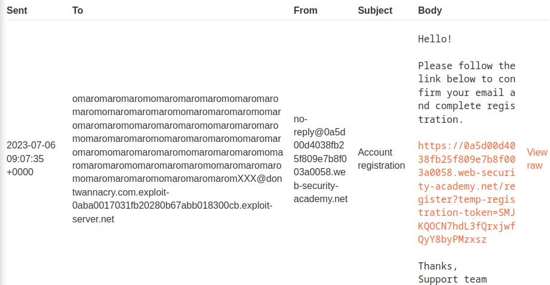
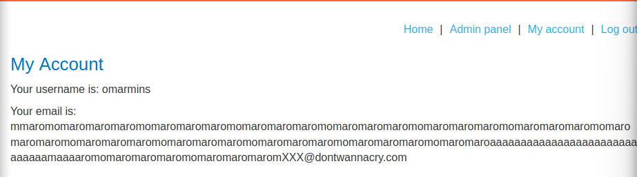
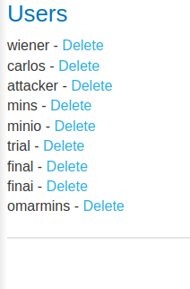

### Inconsistent handling of exceptional input : PRACTITIONER

---

We need to delete the user `carlos` as an admin.

> We need to have an account, or understand how the website works, so heading to the Register page.


We see that admins have an email with domain `@dontwannacry`.
- Trying to register using an email with `@dontwannacry`.



Heading to the email client to confirm the registration, we don't see any incoming email. The email address associated with this client is:

```
@exploit-0aba0017031fb20280b67abb018300cb.exploit-server.net
```

Trying to register with this email.



> Opening the link completes the registration process.

Trying to tamper with the email address to understand its limits, we see that it is a string, and sometimes the limit is 256 characters. 
- Trying an email address with 300 characters:
```
omaromaromaromomaromaromaromomaromaromaromomaromaromaromomaromaromaromomaromaromaromomaromaromaromomaromaromaromomaromaromaromomaromaromaromomaromaromaromomaromaromaromomaromaromaromomaromaromaromomaromaromaromomaromaromaromomaromaromaromomaromaromaromYYYYYYYYYYYYYYYYYYYYYYYYYYYYYYYYYYYYYYY@exploit-0aba0017031fb20280b67abb018300cb.exploit-server.net
```

> Registering with this address and username and password `trial`. Clicking on the email and confirming the registration process. Then, heading over to the my account page and logging in.



We see that the email address is truncated to exactly 255 characters.
- Lets use this to our advantage.

> Since admins have the domain `dontwannacry.com`, we can use this truncation to 255 characters to make our email end with this domain.

We also need to send it to our email, so we add our own domain `@exploit-0aba0017031fb20280b67abb018300cb.exploit-server.net` at the end either way.
- So the email would like this:
```
mmaromomaromaromaromomaromaromaromomaromaromaromomaromaromaromomaromaromaromomaromaromaromomaromaromaromomaromaromaromomaromaromaromomaromaromaromomaromaromaromomaromaroaaaaaaaaaaaaaaaaaaaaaaaaaaaaaamaaaaromomaromaromaromomaromaromaromXXX@dontwannacry.com.exploit-0aba0017031fb20280b67abb018300cb.exploit-server.net
```
- Making sure that the `m` in `dontwannacry.com` is character 255.

> Registering as an admin user now.



> Finishing the registration process and checking the email client, we get the registration confirmation email.



Clicking on the link, the registration is complete.
- Heading to my account and logging with `omarmins:omarmins`.



> We see the email is the admin email. We see the admin panel as well.



Deleting the carlos user completes the lab.

---
