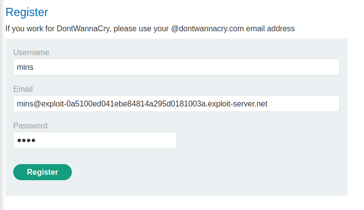
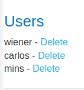

### Inconsistent security controls : APPRENTICE

---

> Similar to [[Portswigger/Business Logic Vulnerabilities/Lab 5|Lab 5]], we need to delete `carlos`.
> Moreover, while registering, we need to use the email present in the email client.


```
@exploit-0a5100ed041ebe84814a295d0181003a.exploit-server.net
```

> Visiting the registration page.
> Noticing that admin privileges might be available if an account with the `dontwannacry` domain logs in.


> Registering with the email given in the client and using credentials `mins:mins`.



> After registering, checking the email client shows a link to complete registration.


> After completing the process, head to my account to login with the same credentials `mins:mins`.


> Logging in, we are presented with a page to update the email. Trying the `dontwannacry` domain to have admin privileges.


> After updating the email, we see the admin panel button appears, meaning we successfuly gained admin privileges.


> Pressing on the admin panel, we are presented with the list of users.



> Deleting carlos to complete the lab.

---
