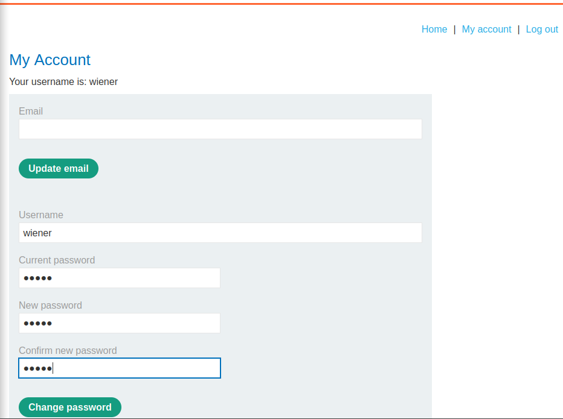
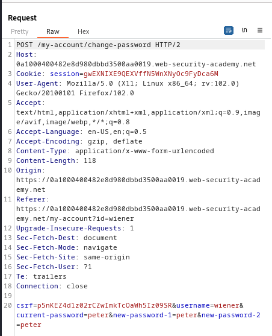
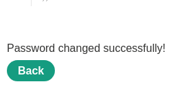
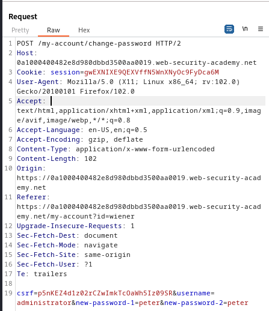
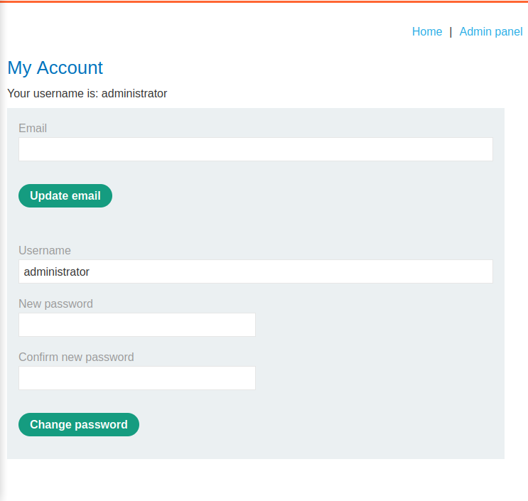
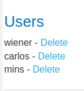

### Weak isolation on dual-use endpoint : PRACTITIONER

---

> We need to access the `administrator` account and delete the user with username `carlos`.
> My credentials `wiener:peter`.

> Logging in as `wiener`.

> We are presented with the my account page.

> We can change the password of the user, changing it to `peter` again, and capturing the `POST` request sent via BURPSUITE INTERCEPT HTTP history.

> Sending that request we get the page saying that the password was changed successfuly.

> The `POST` request above has several body parameters.
> To login as `administrator`, we need to tamper with those parameters.

> First, changing the username to `administrator`.
> Second, try removing the `current-password` parameter with its value and see the response.

> The webpage responds normally, meaning the change we did worked.

> Trying to login with credentials `administrator:peter`.

> We get the admin page, and above is the admin panel.

> Accessing it, we can delete the `carlos` user to complete the lab.

---

