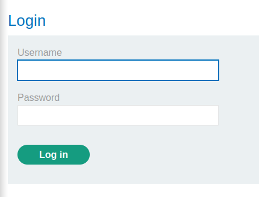

### 2FA simple bypass : APPRENTICE

---

> My Credentials `wiener:peter`.
> Victim Credentials `carlos:montoya`.


> Head to the login page in the My Account page.



> Enter my credentials to see how the website implements their 2FA. `wiener:peter`.

> Once im logged in, im prompted to enter a 4 digit security code.


> Head over to the email client and check the verification code that was sent.


> My code is `0953`. Entering that in the login prompt unlocks my account.


> Maybe this `My Account` page is loaded even before the verification step is complete, so we note its URL.
```
https://0aac00c10383c46e83fa5afc00c80007.web-security-academy.net/my-account
```

> Then we login as `carlos:montoya` and simply change the last part of the URL to take us to the `my account` page.


> And we are now logged in as carlos to complete the lab.

---
