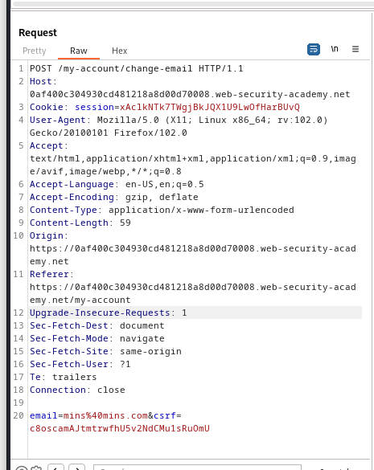
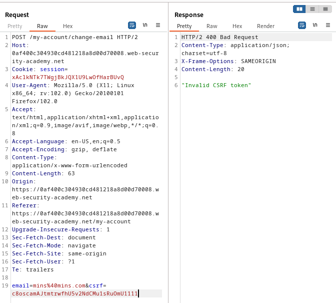
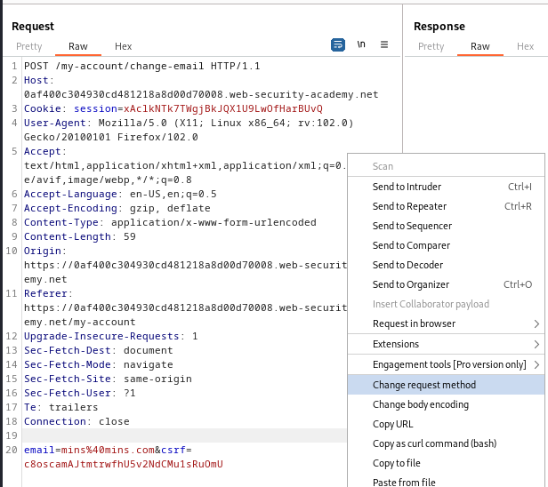
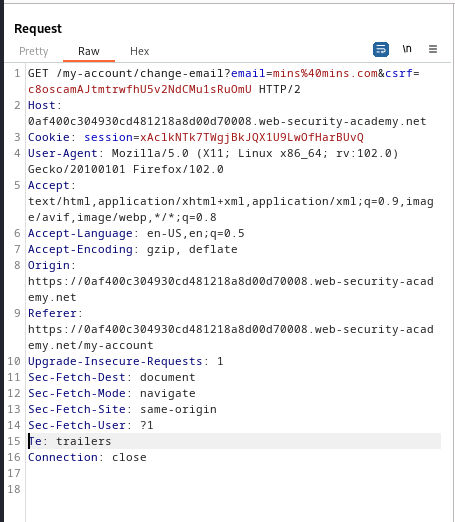
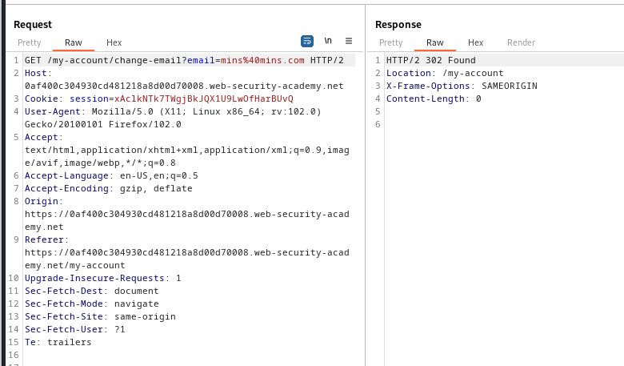
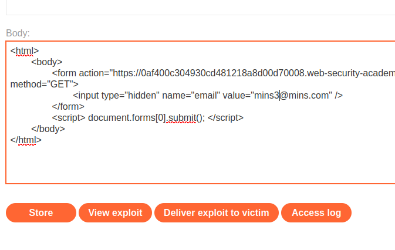

### CSRF where token validation depends on request method : PRACTITIONER

---

Given credentials `wiener:peter`, we need to create a CSRF attack to change the email of the victim user.

Logging in with the given credentials.


We see this page.


We know that the update email is vulnerable to CSRF.
- Capturing a `POST` request via BURPSUITE PROXY HTTP history while updating the email address.



There is a `csrf` token.
- Trying to play with it doesn't work.



We can try to change the type of request method to `GET` and see if the `csrf` parameter is not verified.





> Now if we try to modify or delete the token, the request works fine.



This request shows that there is a CSRF vulnerability as there is an action we can exploit, use session cookies to identify users, and no hidden parameters that are hard to guess (CSRF token).

- Creating the HTML payload similar to [[Portswigger/CSRF/Lab 1|Lab 1]]:
``` HTMl
<html> 
	<body> 
		<form action="https://https://0af400c304930cd481218a8d00d70008.web-security-academy.net/my-account/change-email" method="GET"> 
			<input type="hidden" name="email" value="mins3@mins.com" /> 
		</form> 
		<script> document.forms[0].submit(); </script> 
	</body> 
</html>
```

Heading to exploits server and adding it in the body.



Delivering the exploit to victim and then refreshing the my-account page, we see that we updated the email to the one we entered.

---
